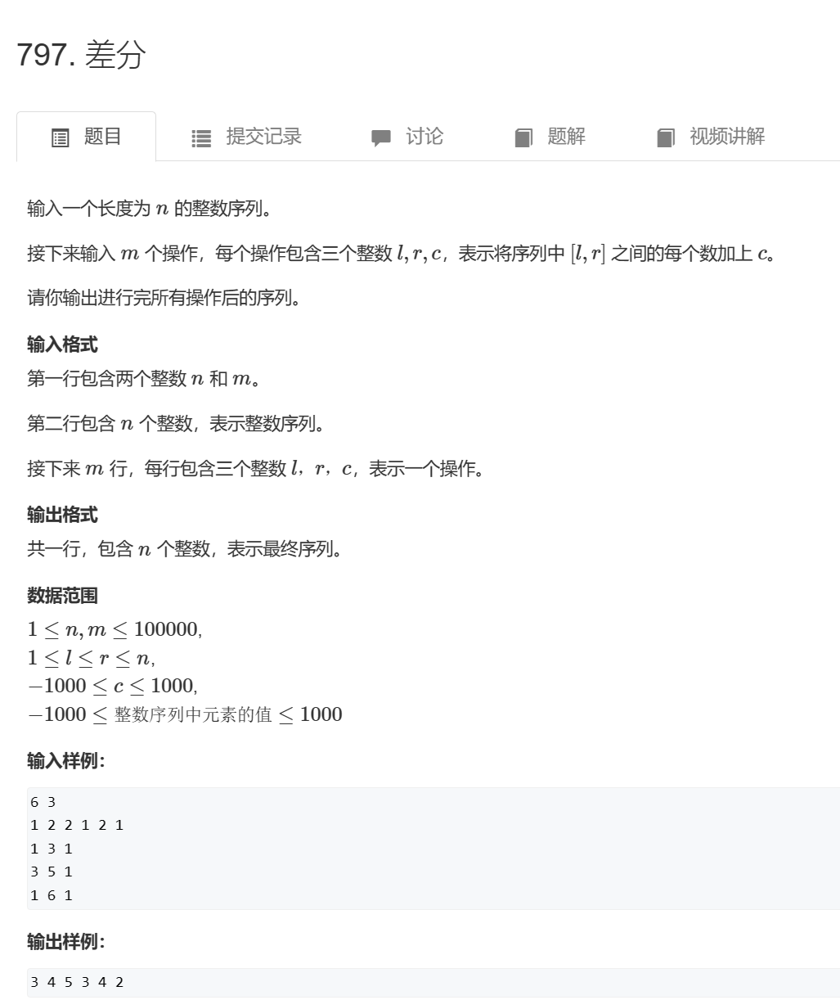
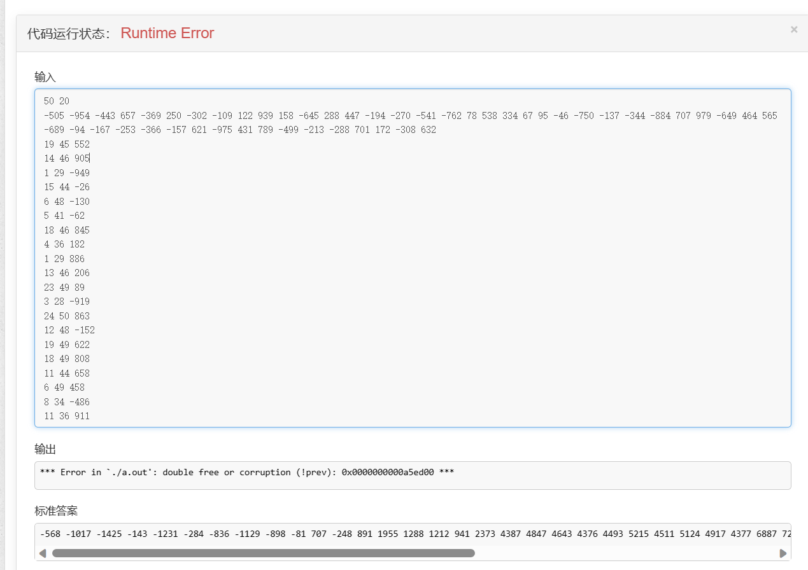
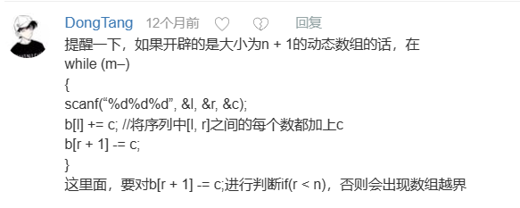
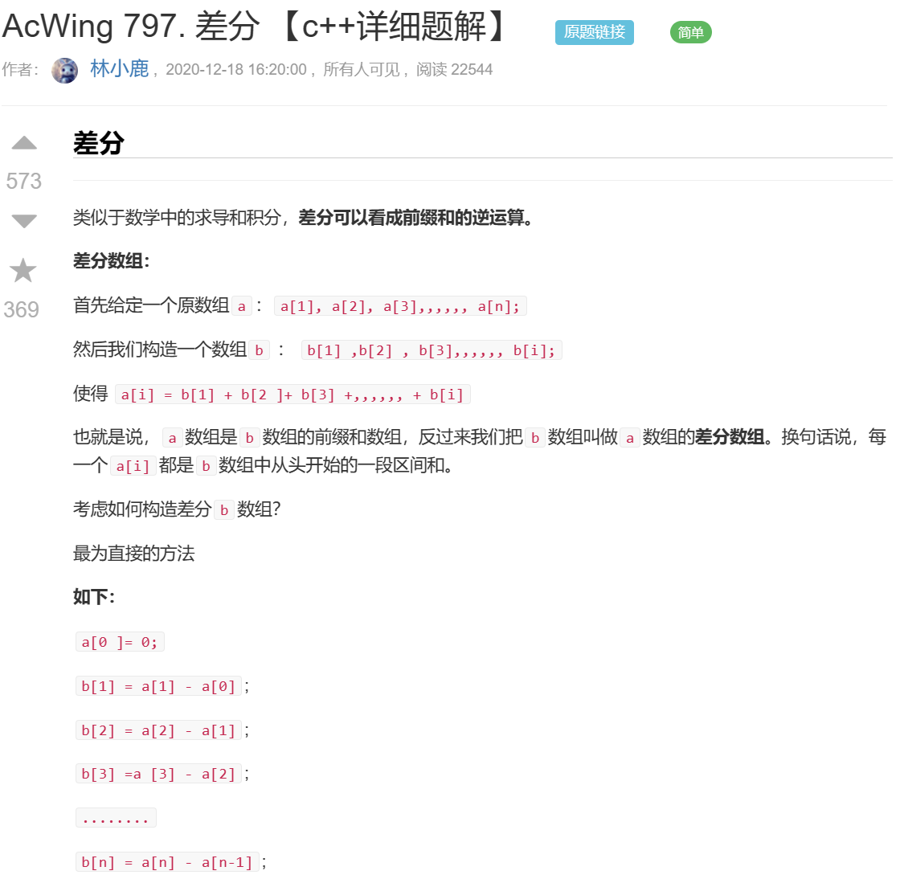
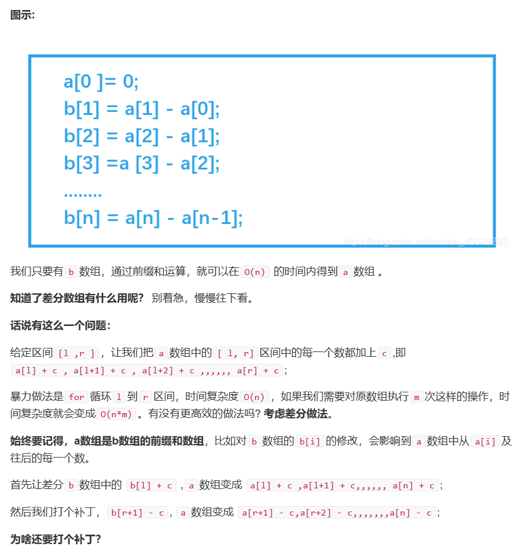
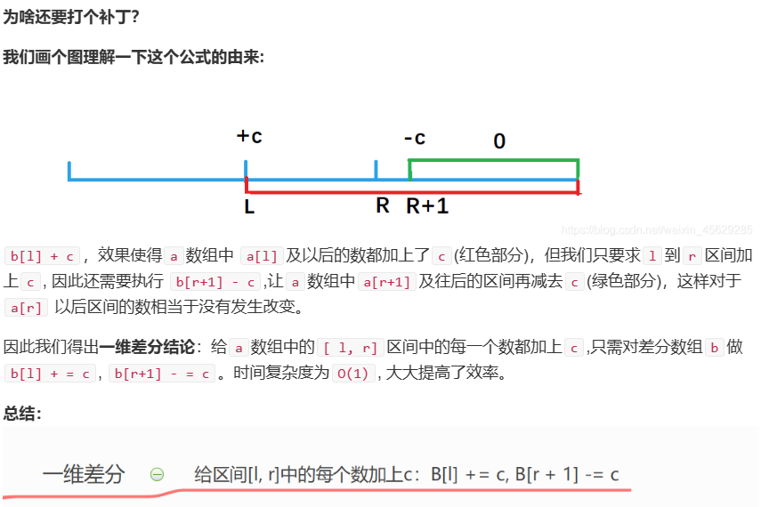

# 题目



# 我的题解

```cpp
#include<bits/stdc++.h>
using namespace std;


int main(){
    //使用差分数组，首先a[i]为前缀和数组，b[i]为差分数组
    //a[i]的大小为1+n,b[i]的大小为n
    
    //关键是a[i]=b[0]+b[1]+...+b[i]   b[i]=a[i]-a[i-1]  如果b[i]加上一个c，则a[i]和a[i]后面的数组 都加上了c
    //而[l,r]区间的值等
    int n=0,m=0;
    cin>>n>>m;
    vector<int>pre(n+1,0);
    vector<int>diff(n+1,0);
    //直接把输入数组看成前缀和数组
    for(int i=1;i<=n;i++){
        cin>>pre[i];
        diff[i]=pre[i]-pre[i-1];//构造差分数组
    }
    //区间加c
    while(m--){
        int l,r,c;
        cin>>l>>r>>c;
        diff[l]+=c;
        diff[r+1]-=c;
    }
    //重新展示前缀和
    //利用差分数组计算
    for(int i=1;i<=n;i++){
        pre[i]=diff[i]+pre[i-1];
        cout<<pre[i]<<" ";
    }
    
    return 0;
}


```

会出现这个错，但是不知道为什么答案是对的



然后看到这个评论，意思是区间可能超过，所以要进行判断下



修改后的代码

```cpp
#include<bits/stdc++.h>
using namespace std;


int main(){
    //使用差分数组，首先a[i]为前缀和数组，b[i]为差分数组
    //a[i]的大小为1+n,b[i]的大小为n
    
    //关键是a[i]=b[0]+b[1]+...+b[i]   b[i]=a[i]-a[i-1]  如果b[i]加上一个c，则a[i]和a[i]后面的数组 都加上了c
    //而[l,r]区间的值等
    int n=0,m=0;
    cin>>n>>m;
    vector<int>pre(n+1,0);
    vector<int>diff(n+1,0);
    //直接把输入数组看成前缀和数组
    for(int i=1;i<=n;i++){
        cin>>pre[i];
        diff[i]=pre[i]-pre[i-1];//构造差分数组
    }
    //区间加c
    while(m--){
        int l,r,c;
        cin>>l>>r>>c;
        diff[l]+=c;
        if(r<=n) diff[r+1]-=c;
    }
    //重新展示前缀和
    //利用差分数组计算
    for(int i=1;i<=n;i++){
        pre[i]=diff[i]+pre[i-1];
        cout<<pre[i]<<" ";
    }
    
    return 0;
}
```


# 其他题解










```cpp
//差分 时间复杂度 o(m)
#include<iostream>
using namespace std;
const int N = 1e5 + 10;
int a[N], b[N];
int main()
{
    int n, m;
    scanf("%d%d", &n, &m);
    for (int i = 1; i <= n; i++)
    {
        scanf("%d", &a[i]);
        b[i] = a[i] - a[i - 1];      //构建差分数组
    }
    int l, r, c;
    while (m--)
    {
        scanf("%d%d%d", &l, &r, &c);
        b[l] += c;     //将序列中[l, r]之间的每个数都加上c
        b[r + 1] -= c;
    }
    for (int i = 1; i <= n; i++)
    {
        a[i] = b[i] + a[i - 1];    //前缀和运算
        printf("%d ", a[i]);
    }
    return 0;
}

```


