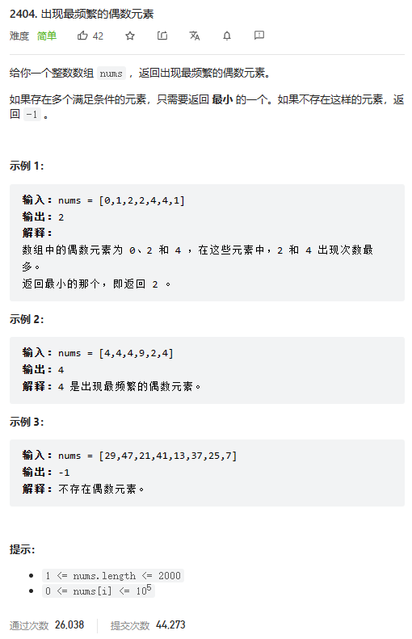

# 题目




# 我的题解

哈希表法

```cpp
class Solution {
public:
    int mostFrequentEven(vector<int>& nums) {
        unordered_map<int,int> map;
        for(int i=0;i<nums.size();i++){
            if(nums[i]%2==0)
            map[nums[i]]++;
        }
        int res=INT_MAX;
        int count=0;
        for(auto &i:map){
            if(i.second>count){
                count=i.second;
                res=i.first;
            }
            else if(i.second==count){
                res=i.first<res?i.first:res;
            }
        }
        if(res==INT_MAX)return -1;
        return res;
    }
};
```


# 其他题解


