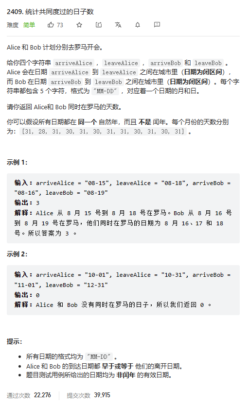
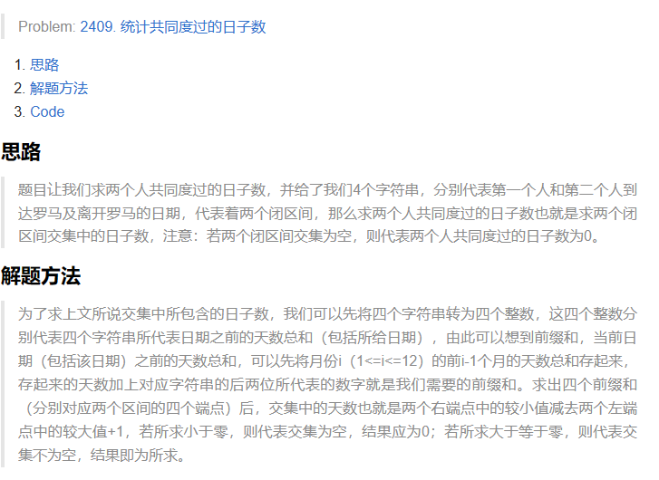

# 题目



# 我的题解

感觉这道题有一点区间思想


# 其他人解法

### **方法一：模拟**

我们将日期转换为天数，然后计算两个人在罗马的天数。

```c++
class Solution {
public:
    vector<int> days = {31, 28, 31, 30, 31, 30, 31, 31, 30, 31, 30, 31};

    int countDaysTogether(string arriveAlice, string leaveAlice, string arriveBob, string leaveBob) {
        string a = arriveAlice < arriveBob ? arriveBob : arriveAlice;
        string b = leaveAlice < leaveBob ? leaveAlice : leaveBob;
        int x = f(a), y = f(b);
        return max(0, y - x + 1);
    }

    int f(string s) {
        int m, d;
        sscanf(s.c_str(), "%d-%d", &m, &d);
        int res = 0;
        for (int i = 0; i < m - 1; ++i) {
            res += days[i];
        }
        res += d;
        return res;
    }
};

```




```C++
class Solution 
{
public:
    int countDaysTogether(string arriveAlice, string leaveAlice, string arriveBob, string leaveBob) 
    {
        static map<int, int> pretime = { {0,0}, {1,31},{2,59}, {3,90}, {4,120}, {5,151}, {6,181}, {7,212}, {8,243}, {9,273}, {10,304}, {11,334} };
		int time1 = pretime[(arriveAlice[0] - '0') * 10 + (arriveAlice[1] - '0') - 1] + (arriveAlice[3] - '0') * 10 + (arriveAlice[4] - '0');
		int time2 = pretime[(leaveAlice[0] - '0') * 10 + (leaveAlice[1] - '0') - 1] + (leaveAlice[3] - '0') * 10 + (leaveAlice[4] - '0');
		int time3 = pretime[(arriveBob[0] - '0') * 10 + (arriveBob[1] - '0') - 1] + (arriveBob[3] - '0') * 10 + (arriveBob[4] - '0');
		int time4 = pretime[(leaveBob[0] - '0') * 10 + (leaveBob[1] - '0') - 1] + (leaveBob[3] - '0') * 10 + (leaveBob[4] - '0');
		int ans = min(time4, time2) - max(time3, time1) + 1;
		return ans <= 0 ? 0 : ans;
    }
};

```


### 方法一：分别计算出每个日子是一年中的第几天后求差

思路

我们可以设计一个函数 calculateDayOfYear 来计算输入中的每个日子在一年中是第几天。计算输入中的每个日子在一年中是第几天时，可以利用前缀和数组来降低每次计算的复杂度。知道每个日子是一年中的第几天后，可以先通过比较算出两人到达日子的最大值，离开日子的最小值，然后利用减法计算重合的日子。

代码

```cpp
class Solution {
public:
    int countDaysTogether(string arriveAlice, string leaveAlice, string arriveBob, string leaveBob) {
        vector<int> datesOfMonths = {31, 28, 31, 30, 31, 30, 31, 31, 30, 31, 30, 31};
        vector<int> prefixSum(1, 0);
        for (int date : datesOfMonths) {
            prefixSum.emplace_back(prefixSum.back() + date);
        }

        int arriveAliceDay = calculateDayOfYear(arriveAlice, prefixSum);
        int leaveAliceDay = calculateDayOfYear(leaveAlice, prefixSum);
        int arriveBobDay = calculateDayOfYear(arriveBob, prefixSum);
        int leaveBobDay = calculateDayOfYear(leaveBob, prefixSum);
        return max(0, min(leaveAliceDay, leaveBobDay) - max(arriveAliceDay, arriveBobDay) + 1);
    }

    int calculateDayOfYear(string day, const vector<int> &prefixSum) {
        int month = stoi(day.substr(0, 2));
        int date = stoi(day.substr(3));
        return prefixSum[month - 1] + date;
    }
};       

```

atoi  需要string . c_str()来转换成char*

stoi  可以直接string转int