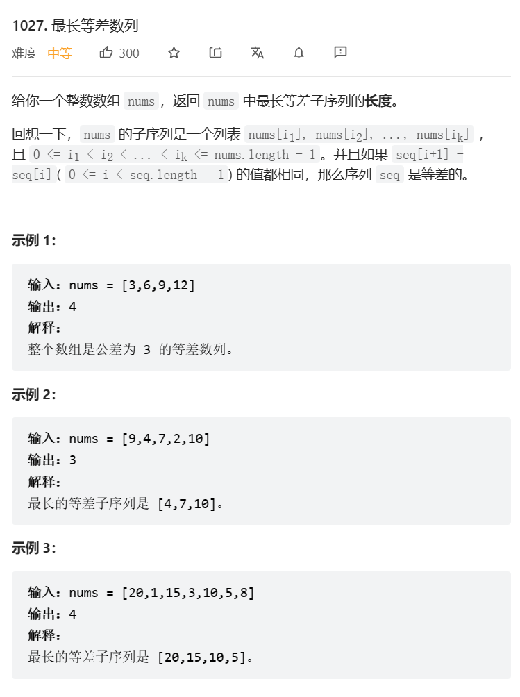
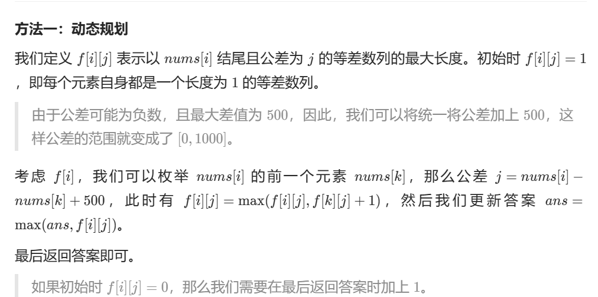

# 题目



# 我的题解


# 其他题解




代码：

```cpp
class Solution {
public:
    int longestArithSeqLength(vector<int>& nums) {
        int n = nums.size();
        int f[n][1001];
        memset(f, 0, sizeof(f));
        int ans = 0;
        for (int i = 1; i < n; ++i) {
            for (int k = 0; k < i; ++k) {
                int j = nums[i] - nums[k] + 500;
                f[i][j] = max(f[i][j], f[k][j] + 1);
                ans = max(ans, f[i][j]);
            }
        }
        return ans + 1;
    }
};

```


```cpp
/dp,dp[i][j]代表以nums[i]结尾，公差为j的最长子序列
//dp[i][j]=max(dp[k][j])+1,where nums[i]-nums[k]=j
//j:-500~500,共1001个，添加偏移量500保证非负
class Solution {
public:
    int longestArithSeqLength(vector<int>& nums) {
        int ans=0,n=nums.size();
        vector<vector<int>> dp(n,vector<int>(1001,1));
        for(int i=0;i<n;++i)
            for(int j=0;j<i;++j)
            {
                int d=nums[i]-nums[j]+500;
                dp[i][d]=max(dp[i][d],dp[j][d]+1);
                ans=max(ans,dp[i][d]);
            }
        return ans;
    }
};
```

