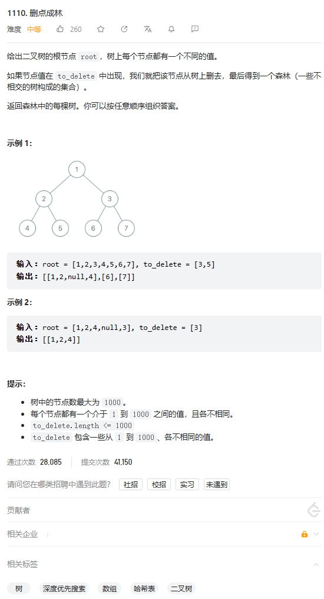
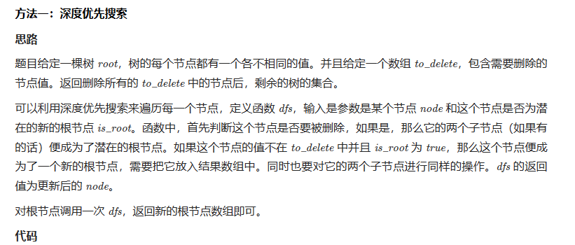
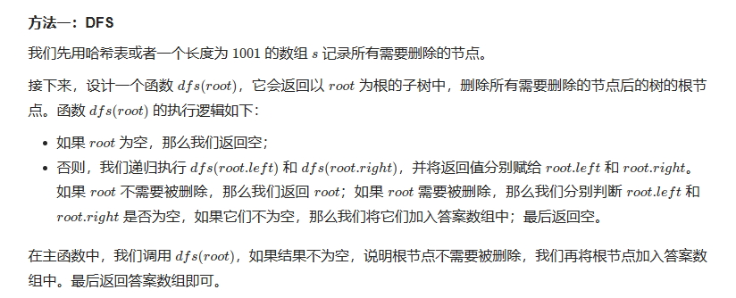

# 题目



# 我的题解


# 其他题解

## other1

官方题解



```cpp
class Solution {
public:
    vector<TreeNode*> delNodes(TreeNode* root, vector<int>& to_delete) {
        unordered_set<int> to_delete_set(to_delete.begin(), to_delete.end());
        vector<TreeNode *> roots;

        function<TreeNode *(TreeNode *, bool)> dfs = [&](TreeNode* node, bool is_root) -> TreeNode * {
            if (node == nullptr) {
                return nullptr;
            }
            bool deleted = to_delete_set.count(node->val) ? true : false;
            node->left = dfs(node->left, deleted);
            node->right = dfs(node->right, deleted);
            if (deleted) {
                return nullptr;
            } else {
                if (is_root) {
                    roots.emplace_back(node);
                }
                return node;
            }
        };

        dfs(root, true);
        return roots;
    }
};
```


## other2



```cpp
/**
 * Definition for a binary tree node.
 * struct TreeNode {
 *     int val;
 *     TreeNode *left;
 *     TreeNode *right;
 *     TreeNode() : val(0), left(nullptr), right(nullptr) {}
 *     TreeNode(int x) : val(x), left(nullptr), right(nullptr) {}
 *     TreeNode(int x, TreeNode *left, TreeNode *right) : val(x), left(left), right(right) {}
 * };
 */
class Solution {
public:
    vector<TreeNode*> delNodes(TreeNode* root, vector<int>& to_delete) {
        bool s[1001];
        memset(s, 0, sizeof(s));
        for (int x : to_delete) {
            s[x] = true;
        }
        vector<TreeNode*> ans;
        function<TreeNode*(TreeNode*)> dfs = [&](TreeNode* root) -> TreeNode* {
            if (!root) {
                return nullptr;
            }
            root->left = dfs(root->left);
            root->right = dfs(root->right);
            if (!s[root->val]) {
                return root;
            }
            if (root->left) {
                ans.push_back(root->left);
            }
            if (root->right) {
                ans.push_back(root->right);
            }
            return nullptr;
        };
        if (dfs(root)) {
            ans.push_back(root);
        }
        return ans;
    }
};

```

