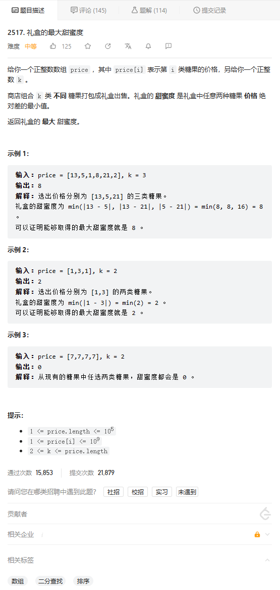

# 题目



# 我的题解

## 思路：二分查找 

最大、最小 常想到使用二分查找

但是好像不会写


# 其他题解

## other1:

```cpp
class Solution {
public:
    int maximumTastiness(vector<int>& price, int k) {
        sort(price.begin(), price.end());
        int n = price.size();
        int l = 0, r = price[n - 1] - price[0];
        while (l < r) {
            int mid = (l + r + 1) / 2; // [l,r+1)
            int cnt = 1; // 以mid为礼盒最大甜蜜度
            // 枚举数组price,看能否找到相差至少为mid的k个数
            for (int i = 0, j; i < n; i = j) {
                j = lower_bound(price.begin() + i + 1, price.end(), price[i] + mid) - price.begin();
                if (j != n) ++cnt; // 找到一个数j,和i差>=mid
            }
            if (cnt >= k) l = mid; // 可满足最大甜蜜度为mid
            else r = mid - 1;
        }
        return l;
    }
};
```

