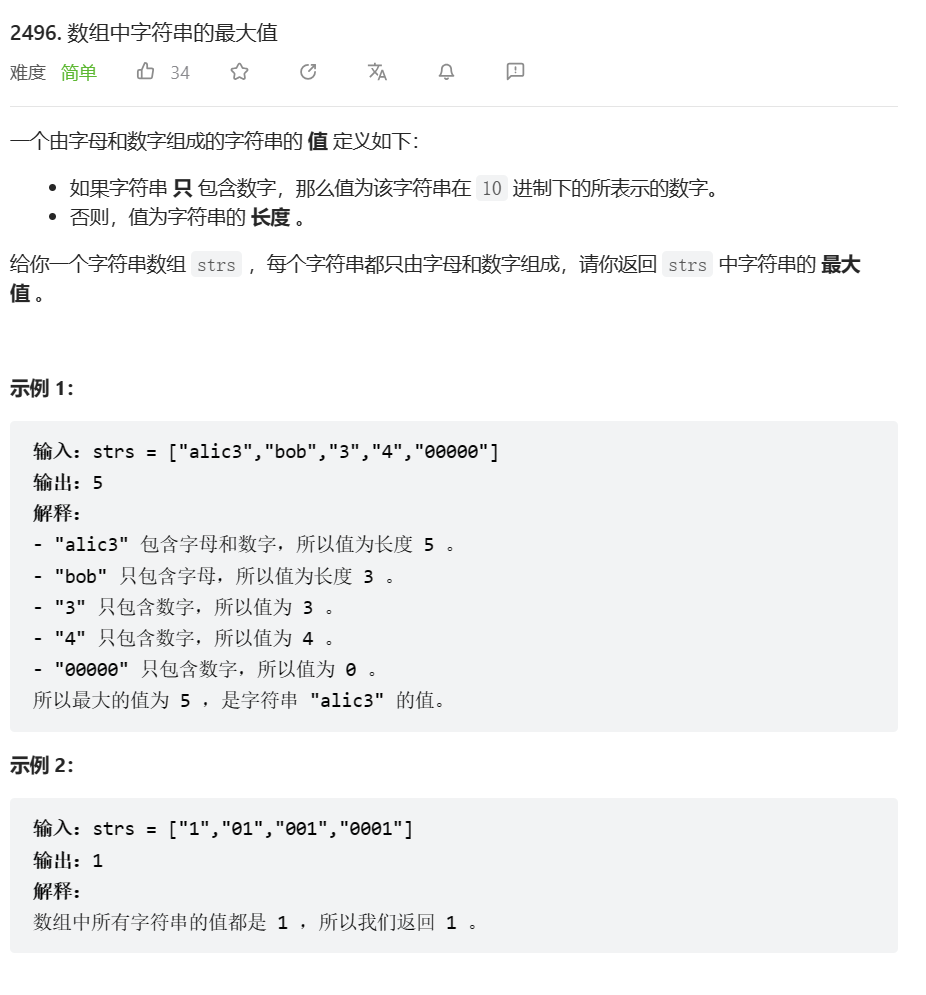

# 题目



# 我的题解

### 模拟 暴力

注意有可能会有多位数字，而不是只是个位数字

使用了flag来判断是否要继续判断

```cpp
class Solution {
public:
    int maximumValue(vector<string>& strs) {
        //内部一次遍历，记录数字大小，如果有字符，则统计长度
        //外部遍历，记录最大值
        int ret = 0;
        for(int i = 0; i < strs.size(); i++){
            int size = strs[i].size();
            int digit = 0;
            bool flag = false;
            int temp = 0;
            for(char &c : strs[i]){
                if(isdigit(c) && !flag) digit = digit * 10 + c - '0';
                else {
                    flag = true;
                    break;
                }
            }
            temp = flag==true?size:digit;
            ret = max(ret,temp);
        } 
        return ret;
    }
};
```


# 其他题解

### 思路：模拟

```cpp
class Solution {
public:
    int maximumValue(vector<string>& strs) {
        auto f = [](string& s) {
            int x = 0;
            for (char& c : s) {
                if (!isdigit(c)) {
                    return (int) s.size();
                }
                x = x * 10 + c - '0';
            }
            return x;
        };
        int ans = 0;
        for (auto& s : strs) {
            ans = max(ans, f(s));
        }
        return ans;
    }
};

```

