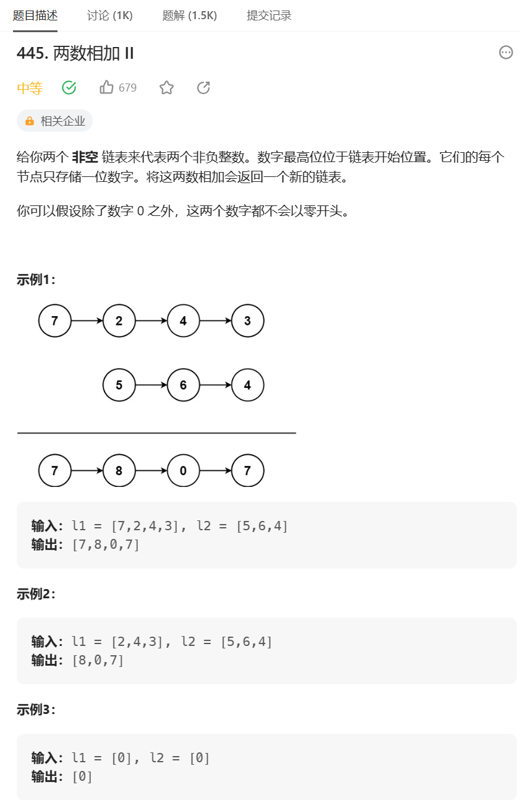
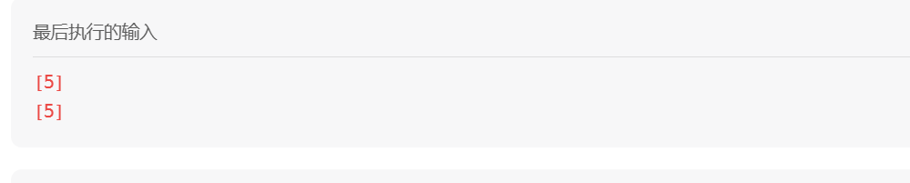

# 题目



# 我的题解

之前做过，这次再做

首先想到就是这题和两数之和的区别是它是从末尾相加的。

所以我想到了使用栈，然后再使用头插法来完成 链表的建立


```C++
/**
 * Definition for singly-linked list.
 * struct ListNode {
 *     int val;
 *     ListNode *next;
 *     ListNode() : val(0), next(nullptr) {}
 *     ListNode(int x) : val(x), next(nullptr) {}
 *     ListNode(int x, ListNode *next) : val(x), next(next) {}
 * };
 */
class Solution {
public:
    ListNode* addTwoNumbers(ListNode* l1, ListNode* l2) {
        ListNode* dummy = nullptr;
        stack<ListNode*> st1, st2;
        ListNode *cur1 = l1, *cur2 = l2;
        while(cur1){
            st1.push(cur1);
            cur1 = cur1->next;
        }
        while(cur2){
            st2.push(cur2);
            cur2 = cur2->next;
        }

        int index = 0;
        ListNode *cur3 = new ListNode();
            ListNode *cur4 = new ListNode();
        while(!st1.empty() || !st2.empty() || index){
            
            int temp3 = 0, temp4 = 0;
            if(!st1.empty()) {
                cur3 = st1.top();
                temp3 = cur3->val;
                st1.pop();
            }
            if(!st2.empty()) {
                cur4 = st2.top();  
                temp4 = cur4->val;    
                st2.pop(); 
            } 
            cout << temp3 << temp4 << index << endl;
            int temp = temp3 + temp4 + index;
            ListNode *node = new ListNode(temp % 10);
            index = temp / 10;
            //头插法
            node->next = dummy;
            dummy = node;
        }
        return dummy;
    }
};
```


这里主要遇到过问题  

就是我创建dummy时，我创建了一个 ListNode(0)，但是这个并不能算空，我需要的是一个真正的空作为末尾


还有就是插入示例[5] [5]时

错误了，只输出一个0，没有输出[1,0]，让我意识到循环条件还需要  进位index




这次基本独立完成的，思路过程基本与第一次一样，还是难得的。


之前写的答案也贴在这

```C++
/**
 * Definition for singly-linked list.
 * struct ListNode {
 *     int val;
 *     ListNode *next;
 *     ListNode() : val(0), next(nullptr) {}
 *     ListNode(int x) : val(x), next(nullptr) {}
 *     ListNode(int x, ListNode *next) : val(x), next(next) {}
 * };
 */
class Solution {
public:
    ListNode* addTwoNumbers(ListNode* l1, ListNode* l2) {
        stack<int> st1,st2;
        while(l1){
            st1.push(l1->val);
            l1=l1->next;
        }
        while(l2){
            st2.push(l2->val);
            l2=l2->next;
        }
        int t=0;
        ListNode* dummy=nullptr;
        ListNode* cur=dummy;
        while(!st1.empty()||!st2.empty()||t){
            if(!st1.empty()){
                t+=st1.top();
                st1.pop();
            }
            if(!st2.empty()){
                t+=st2.top();
                st2.pop();
            }
            ListNode* node=new ListNode(t%10);
            node->next=cur;
            cur=node;
            t/=10;
        }
        return cur;

    }
};
```

