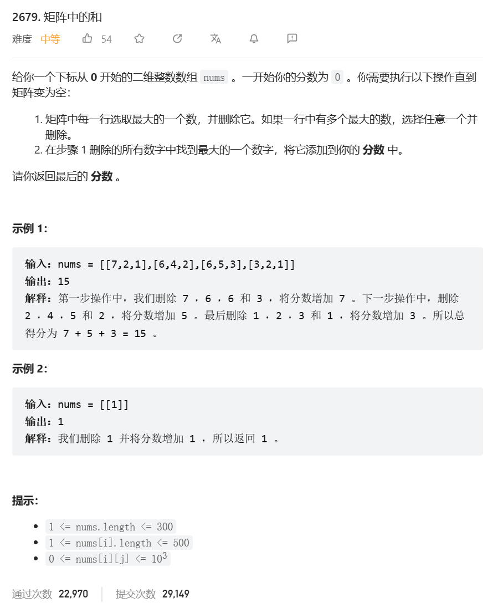

# 题目



# 我的题解

思路：模拟

由于无法做到删除，决定选择每一行跳过上一个最大的数

行数可能很多，先使用二层for循环来遍历吧

感觉复杂了，不写了

```cpp
class Solution {
public:
    int matrixSum(vector<vector<int>>& nums) {
        int ret = 0;
        int prermax = 0;
        for(int i = 0; i < nums.size(); ++i){
            int rmaxfirst = 0, rmaxsecond = 0; 
            for(int j = 0; j < nums[i].size(); ++j){
                //rmaxfirst = nums[i][j] > rmaxfirst ? nums[i][j] : rmaxfirst; 
                if(nums[i][j] > rmaxfirst){
                    rmaxsecond = rmaxfirst;
                    rmaxfirst = nums[i][j];
                }
                else if(nums[i][j] <= rmaxfirst && nums[i][j] > rmaxsecond){
                    rmaxsecond 
                }
            }
        }
    }
};
```

思路：排序

```cpp
class Solution {
public:
    int matrixSum(vector<vector<int>>& nums) {
        for(int i = 0; i < nums.size(); ++i){
            sort(nums[i].begin(), nums[i].end(), [](int a, int b){ return a > b; });
        }
        int ret = 0;
        int j = 0;
        for(int j = 0; j < nums[0].size(); ++j){
            int cmax = 0;
            for(int i = 0; i < nums.size(); ++i){
                cmax = nums[i][j] > cmax ? nums[i][j] : cmax;
            }
            //cout<< cmax;
            ret += cmax;
        }
        return ret;
    }
};
```


```cpp
class Solution {
public:
    int matrixSum(vector<vector<int>>& nums) {
        for (auto& row : nums) {
            sort(row.begin(), row.end());
        }
        int ans = 0;
        for (int j = 0; j < nums[0].size(); ++j) {
            int mx = 0;
            for (auto& row : nums) {
                mx = max(mx, row[j]);
            }
            ans += mx;
        }
        return ans;
    }
};
```


# 其他题解

## 其他1

思路：大根堆模拟

设矩阵的行与列的数目分别为 m,n题目要求每次选择每一行中的最大数并删除，每次操作的得分为删除数中的最大值，因此我们可以利用「大堆」进行模拟即可，具体过程如下：

-   将每一行的元素都加入到一个「堆」中，设第 iii 行加入到优先队列 pq\[i\]\[i\]pq\[i\]，堆顶元素即为当前行中的最大值；
-   每次删除时，删除每一行的最大值即堆顶元素，用 maxVal 记录当前删除元素的最大值，此时即可得到当前删除时的得分；
-   根据提议可以知道每次删除时都会删除掉每一行中的一个元素，一共需要 nnn 次删除即可将矩阵中的所有元素删除完。
-   最终返回所有删除得分之和即可；

**代码**

```cpp
class Solution {
public:
    int matrixSum(vector<vector<int>>& nums) {
        int res = 0;
        int m = nums.size();
        int n = nums[0].size();
        vector<priority_queue<int>> pq(m);
        for (int i = 0; i < m; i++) {
            for (int j = 0; j < n; j++) {
                pq[i].emplace(nums[i][j]);
            }
        }
        for (int j = 0; j < n; j++) {
            int maxVal = 0;
            for (int i = 0; i < m; i++) {
                maxVal = max(maxVal, pq[i].top());
                pq[i].pop();
            }
            res += maxVal;
        }
        return res;
    }
};

```

