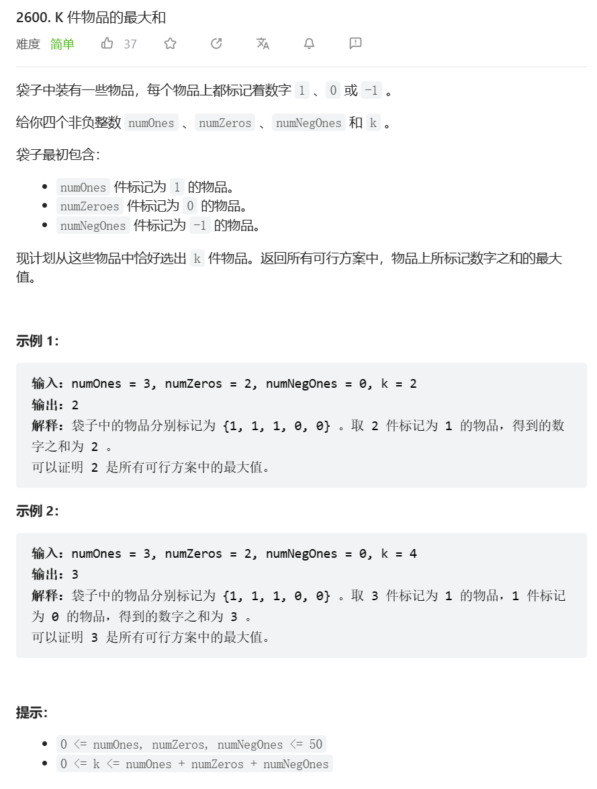

# 题目



# 我的题解

思路：贪心，总是选择优先选择numOnes的物品，然后再选择numZeros，最后选择numNegOnes

有点类似于暴力枚举了

```cpp
class Solution {
public:
    int kItemsWithMaximumSum(int numOnes, int numZeros, int numNegOnes, int k) {
        int ret = 0;
        if(k >= numOnes){
            ret += numOnes;
            k -= numOnes;
        }
        else{
            ret += k;
            return ret;
        }
        if(k >= numZeros){
            k -= numZeros;
        }
        else{
            return ret;
        }
        if(k >= numNegOnes){
            ret -= numNegOnes;
            k -= numNegOnes;
        }
        else{
            ret -= k;
            return ret;
        }
        return ret;
    }
};
```


# 其他题解

## 其他1

思路：贪心

```cpp
class Solution {
public:
    int kItemsWithMaximumSum(int numOnes, int numZeros, int numNegOnes, int k) {
        if (k <= numOnes) {
            return k;
        } else if (k <= numOnes + numZeros) {
            return numOnes;
        } else {
            return numOnes - (k - numOnes - numZeros);
        }
    }
};
```

