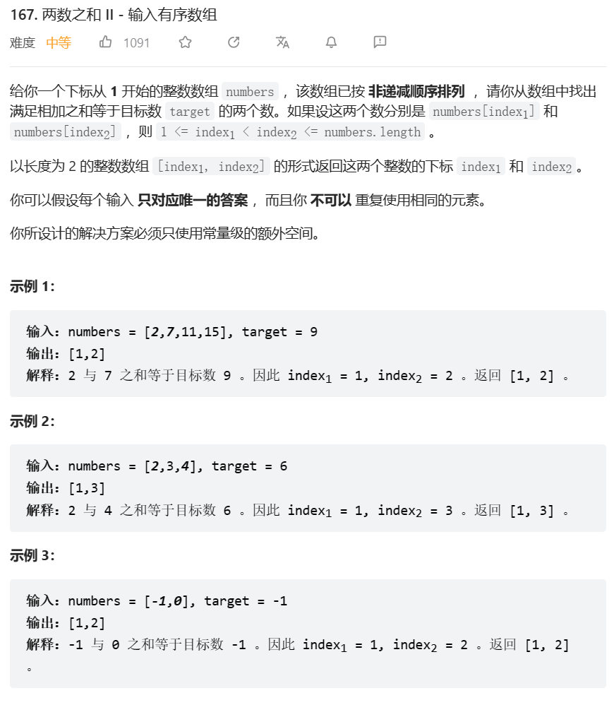
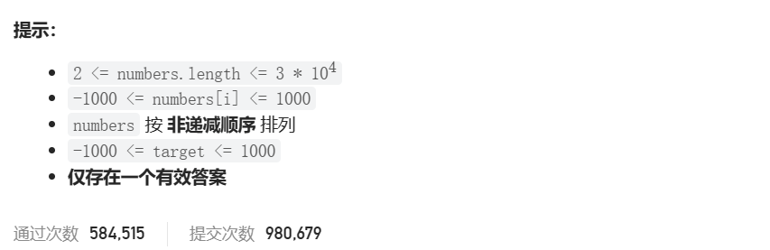

# 题目





# 我的题解

思路：哈希表法

```cpp
class Solution {
public:
    vector<int> twoSum(vector<int>& numbers, int target) {
        //哈希表法
        unordered_map<int,int> hash;
        for(int i = 0; i < numbers.size(); ++i){
            if(hash.count(target - numbers[i])){
                cout<< i <<endl;
                return vector<int>({hash[target - numbers[i]] + 1, i + 1});
            }
            hash[numbers[i]] = i;
        }
        return {};
    }
};
```

但是好像题意是想让我使用二分法


# 其他题解

## 其他1

思路：二分法

```cpp
class Solution {
public:
    vector<int> twoSum(vector<int>& numbers, int target) {
        for (int i = 0; i < numbers.size(); ++i) {
            int low = i + 1, high = numbers.size() - 1;
            while (low <= high) {
                int mid = (high - low) / 2 + low;
                if (numbers[mid] == target - numbers[i]) {
                    return {i + 1, mid + 1};
                } else if (numbers[mid] > target - numbers[i]) {
                    high = mid - 1;
                } else {
                    low = mid + 1;
                }
            }
        }
        return {-1, -1};
    }
};

作者：LeetCode-Solution
链接：https://leetcode.cn/problems/two-sum-ii-input-array-is-sorted/solution/liang-shu-zhi-he-ii-shu-ru-you-xu-shu-zu-by-leet-2/
```

## 其他2

思路：双指针法

```cpp
class Solution {
public:
    vector<int> twoSum(vector<int>& numbers, int target) {
        int low = 0, high = numbers.size() - 1;
        while (low < high) {
            int sum = numbers[low] + numbers[high];
            if (sum == target) {
                return {low + 1, high + 1};
            } else if (sum < target) {
                ++low;
            } else {
                --high;
            }
        }
        return {-1, -1};
    }
};

作者：LeetCode-Solution
链接：https://leetcode.cn/problems/two-sum-ii-input-array-is-sorted/solution/liang-shu-zhi-he-ii-shu-ru-you-xu-shu-zu-by-leet-2/
```

