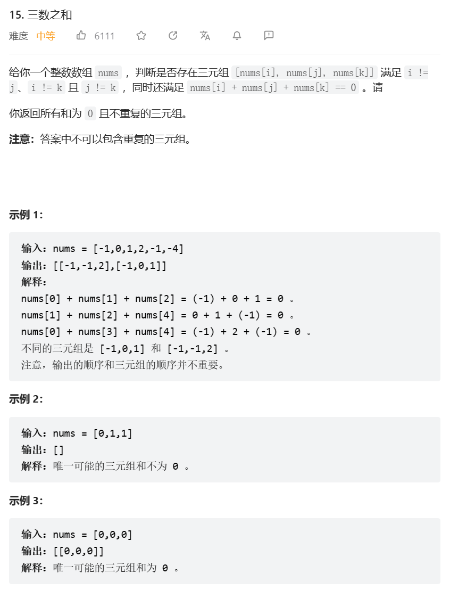

# 题目



# 我的题解

暴力，剪枝

还要防止重复

```c++

```


# 其他题解

## 其他1

思路：暴力剪枝

```cpp
class Solution {
public:
    vector<vector<int>> threeSum(vector<int>& nums) {
        vector<vector<int>> res;
        sort(nums.begin(),nums.end());
        for(int i=0;i<nums.size();i++){
            //已经无法继续找到
            if(nums[i]>0)return res;
            //去重
            if(i>0&&nums[i]==nums[i-1])continue;
            int left=i+1,right=nums.size()-1;
            while(left<right){
                //移动左右指针逻辑
                if(nums[i]+nums[left]+nums[right]>0)right--;
                else if(nums[i]+nums[left]+nums[right]<0)left++;
                else{
                    //找到一个三元组后去重
                    res.push_back({nums[i],nums[left],nums[right]});
                    while(left<right&&nums[left]==nums[left+1])left++;
                    while(left<right&&nums[right]==nums[right-1])right--;
                    //找到之后都会收缩
                    left++,right--;
                }
            }
        }
        return res;
    }
};
```

