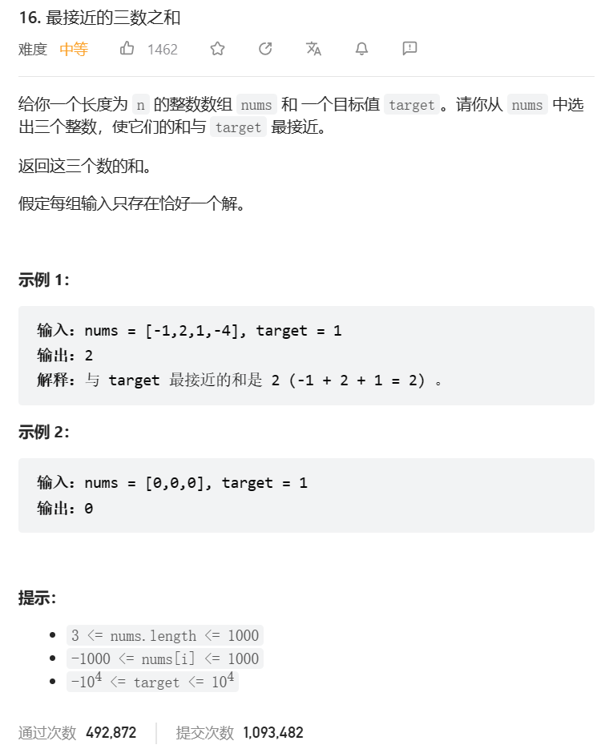
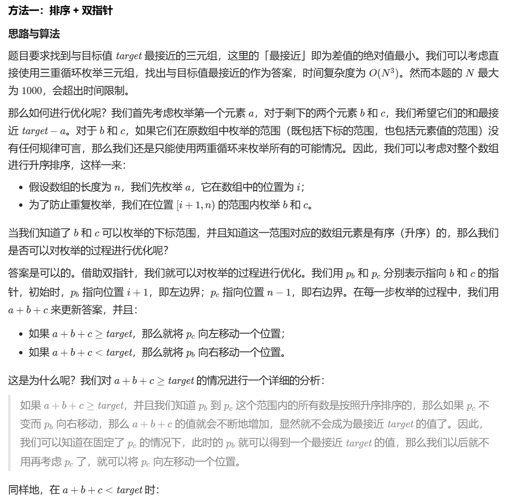

# 题目



# 我的题解

思路

```

```


# 其他题解

## 其他1




```c++
class Solution {
public:
    int threeSumClosest(vector<int>& nums, int target) {
        sort(nums.begin(), nums.end());
        int n = nums.size();
        int best = 1e7;

        // 根据差值的绝对值来更新答案
        auto update = [&](int cur) {
            if (abs(cur - target) < abs(best - target)) {
                best = cur;
            }
        };

        // 枚举 a
        for (int i = 0; i < n; ++i) {
            // 保证和上一次枚举的元素不相等
            if (i > 0 && nums[i] == nums[i - 1]) {
                continue;
            }
            // 使用双指针枚举 b 和 c
            int j = i + 1, k = n - 1;
            while (j < k) {
                int sum = nums[i] + nums[j] + nums[k];
                // 如果和为 target 直接返回答案
                if (sum == target) {
                    return target;
                }
                update(sum);
                if (sum > target) {
                    // 如果和大于 target，移动 c 对应的指针
                    int k0 = k - 1;
                    // 移动到下一个不相等的元素
                    while (j < k0 && nums[k0] == nums[k]) {
                        --k0;
                    }
                    k = k0;
                } else {
                    // 如果和小于 target，移动 b 对应的指针
                    int j0 = j + 1;
                    // 移动到下一个不相等的元素
                    while (j0 < k && nums[j0] == nums[j]) {
                        ++j0;
                    }
                    j = j0;
                }
            }
        }
        return best;
    }
};

```
