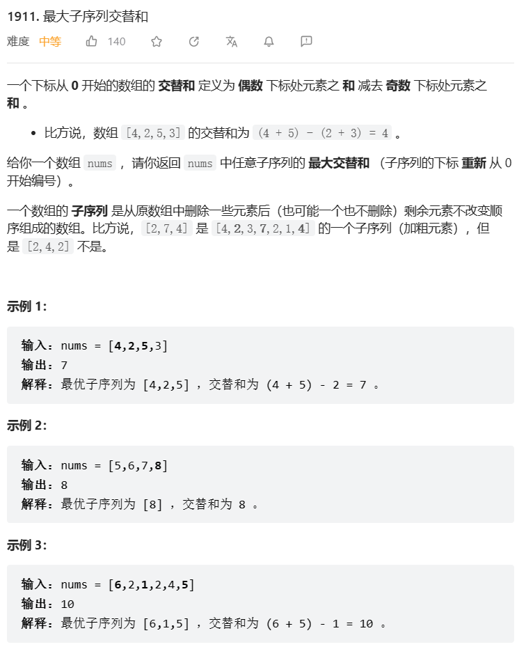
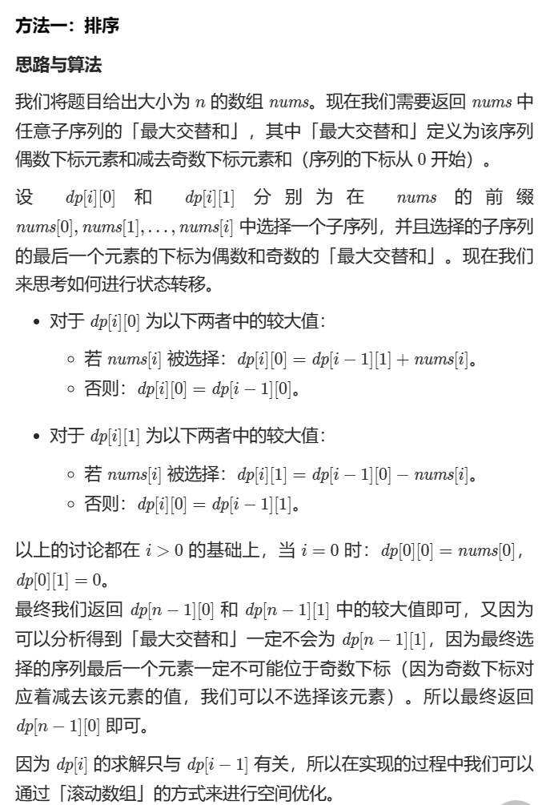

# 题目



# 我的题解

## 思路：


# 其他题解

## 其他1

### 思路




```C++
class Solution {
public:
    long long maxAlternatingSum(vector<int>& nums) {
        long long even = nums[0], odd = 0;
        for (int i = 1; i < nums.size(); i++) {
            even = max(even, odd + nums[i]);
            odd = max(odd, even - nums[i]);
        }
        return even;
    }
};

作者：LeetCode-Solution
链接：https://leetcode.cn/problems/maximum-alternating-subsequence-sum/solution/zui-da-zi-xu-lie-jiao-ti-he-by-leetcode-epqrk/
```

