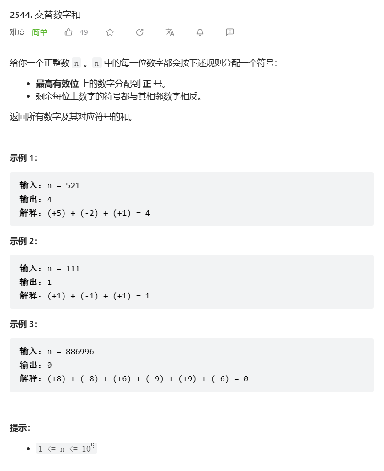

# 题目



# 我的题解

## 思路：暴力，栈

不太会怎么从数字的开头取出数字

```C++
class Solution {
public:
    int alternateDigitSum(int n) {
        int res=0;
        stack<int>vec;
        while (n>0){
            int temp=n%10;
            vec.push(temp);
            n/=10;
        }
        bool flag=true;
        while (!vec.empty()){
            int temp=vec.top();
            if(!flag){
                res-=temp;
            }
            else{
                res+=temp;
            }
            flag=!flag;
            vec.pop();
        }
       return res;
    }
};
```


# 其他题解

## 其他1

思路：数学

```C++
class Solution {
public:
    int alternateDigitSum(int n) {
        int res = 0, sign = 1;
        while (n > 0) {
            res += n % 10 * sign;
            sign = -sign;
            n /= 10;
        }
        return -sign * res;
    }
};

```

## 其他2

```C++
class Solution {
public:
    int alternateDigitSum(int n) {
        int ans = 0, sign = 1;
        for (char c : to_string(n)) {
            int x = c - '0';
            ans += sign * x;
            sign *= -1;
        }
        return ans;
    }
};

```

