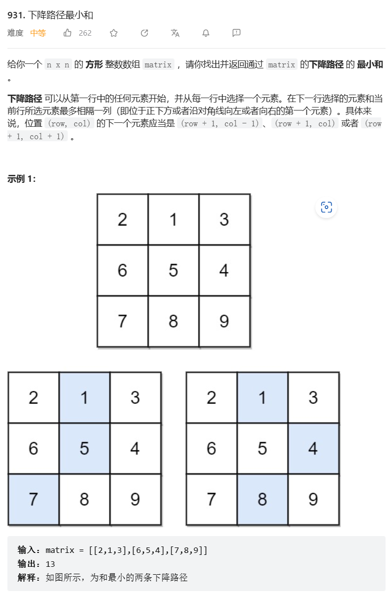
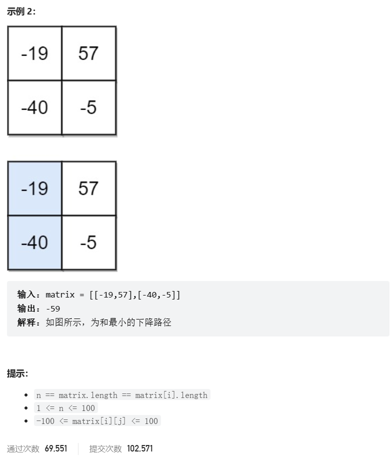
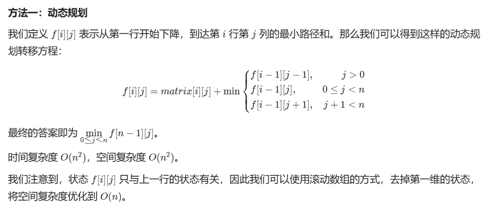

# 题目





# 我的题解

## 思路1：动态规划


## 思路2：dfs深搜

不会，思路混乱，看题解吧，下面是我自己随便写的

```C++
class Solution {
public:
vector<int> res;
    void dfs(vector<vector<int>> &v,int i, int j, int n, int sum){
        sum += v[i][j];
        if(i == n){    
            res.push_back(sum);
            return;
        }
        if(j - 1 < 0) dfs(v, i+1, j, n, sum);
        else if(j + 1 >= v.size()) dfs(v, i+1, j, n, sum);
        if(i + 1 < n){
            dfs(v, i+1, j - 1, n, sum);
        }
        dfs(v, i+1, j + 1, n, sum);
    }
    int minFallingPathSum(vector<vector<int>>& matrix) {
        //dfs
        for(int i = 0; i < matrix[0].size(); ++i){
            //从第一行的每一列开始
            dfs(matrix, 0, i, matrix.size(), 0);
        }
        int ret = *min_element(res.begin(),res.end());
        return ret;
    }
};
```


# 其他题解

## 其他1

思路：动态规划



```C++
class Solution {
public:
    int minFallingPathSum(vector<vector<int>>& matrix) {
        int n = matrix.size();
        vector<int> f(n);
        for (auto& row : matrix) {
            auto g = f;
            for (int j = 0; j < n; ++j) {
                if (j) {
                    g[j] = min(g[j], f[j - 1]);
                }
                if (j + 1 < n) {
                    g[j] = min(g[j], f[j + 1]);
                }
                g[j] += row[j];
            }
            f = move(g);
        }
        return *min_element(f.begin(), f.end());
    }
};

```


