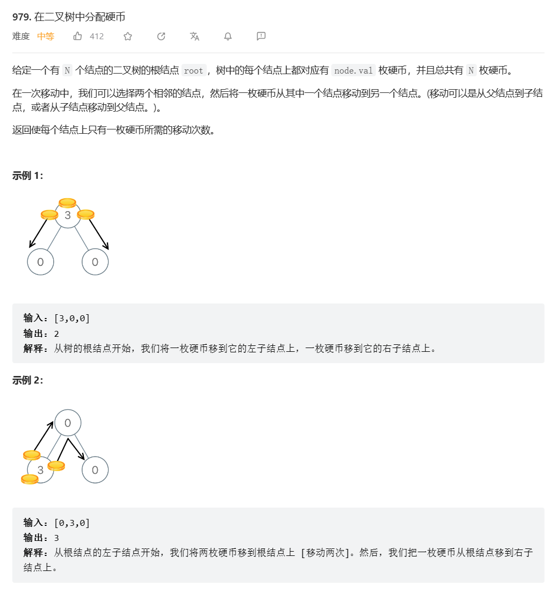
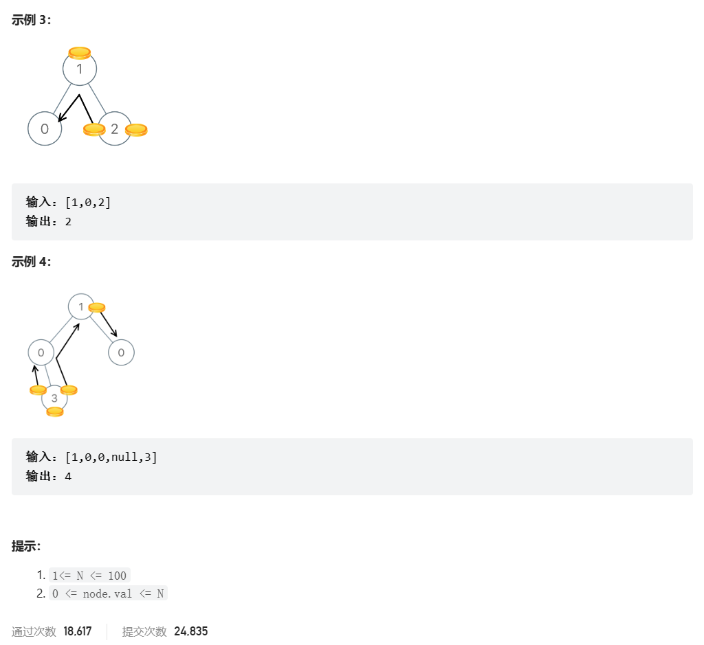
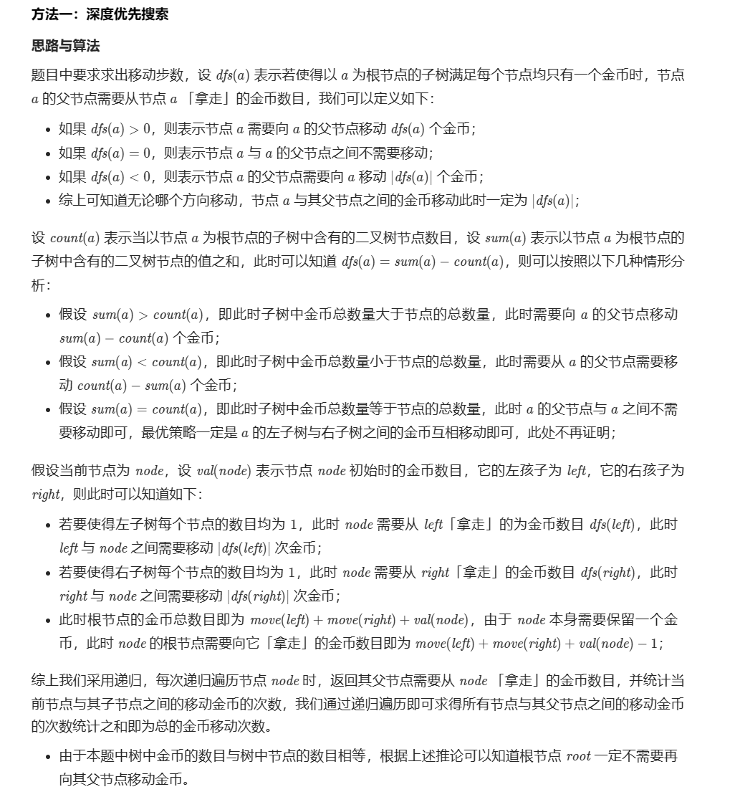

# 题目





# 我的题解

思路：没有

```

```


# 其他题解

## 其他1

思路：



```C++
/**
 * Definition for a binary tree node.
 * struct TreeNode {
 *     int val;
 *     TreeNode *left;
 *     TreeNode *right;
 *     TreeNode() : val(0), left(nullptr), right(nullptr) {}
 *     TreeNode(int x) : val(x), left(nullptr), right(nullptr) {}
 *     TreeNode(int x, TreeNode *left, TreeNode *right) : val(x), left(left), right(right) {}
 * };
 */
class Solution {
public:    
    int distributeCoins(TreeNode* root) {
        int move = 0;

        function<int(const TreeNode *)> dfs = [&](const TreeNode *root) -> int {
            int moveleft = 0;
            int moveright = 0;
            if (root == nullptr) {
                return 0;
            }
            if (root->left) {
                moveleft = dfs(root->left);
            }        
            if (root->right) {
                moveright = dfs(root->right);
            }
            move += abs(moveleft) + abs(moveright);
            return moveleft + moveright + root->val - 1;
        };

        dfs(root);
        return move;
    }
};

//作者：LeetCode-Solution
//链接：https://leetcode.cn/problems/distribute-coins-in-binary-tree/solution/zai-er-cha-shu-zhong-fen-pei-ying-bi-by-e4poq/

```

