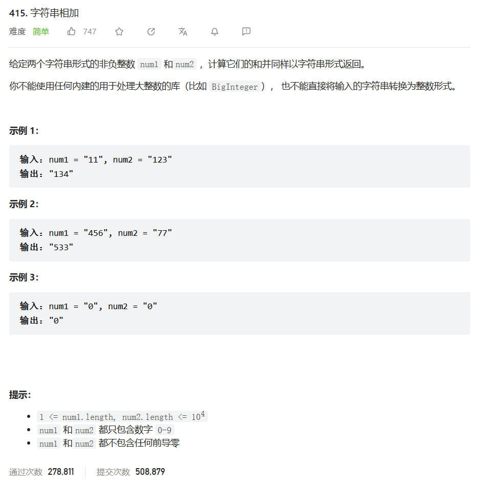
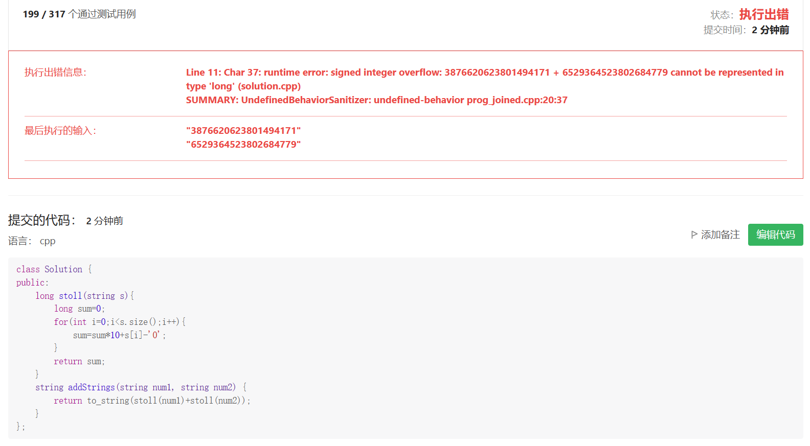

# 题目



# 我的题解

思路：利用提供的算法和转换函数

```C++
class Solution {
public:
    long stoll(string s){
        long sum=0;
        for(int i=0;i<s.size();i++){
            sum=sum*10+s[i]-'0';
        }
        return sum;
    }
    string addStrings(string num1, string num2) {
        return to_string(stoll(num1)+stoll(num2));
    }
};
```

错误，会超出数位




# 其他题解

## 其他1

这题比两数之和2 链表元素相加的那一题稍微简单一点

```C++
class Solution {
public:
    string addStrings(string num1, string num2) {
        string str;
        int cur = 0, i = num1.size()-1, j = num2.size()-1;
        while (i >= 0 || j >= 0 || cur != 0) {
            if (i >= 0) cur += num1[i--] - '0';
            if (j >= 0) cur += num2[j--] - '0';
            str += to_string (cur % 10);//计算个位-十位-百位--
            //但是使用的是加号，需要最后进行反转
            cur /= 10;//取进位
        }
        reverse(str.begin(), str.end());
        return str;
    }
};
```

