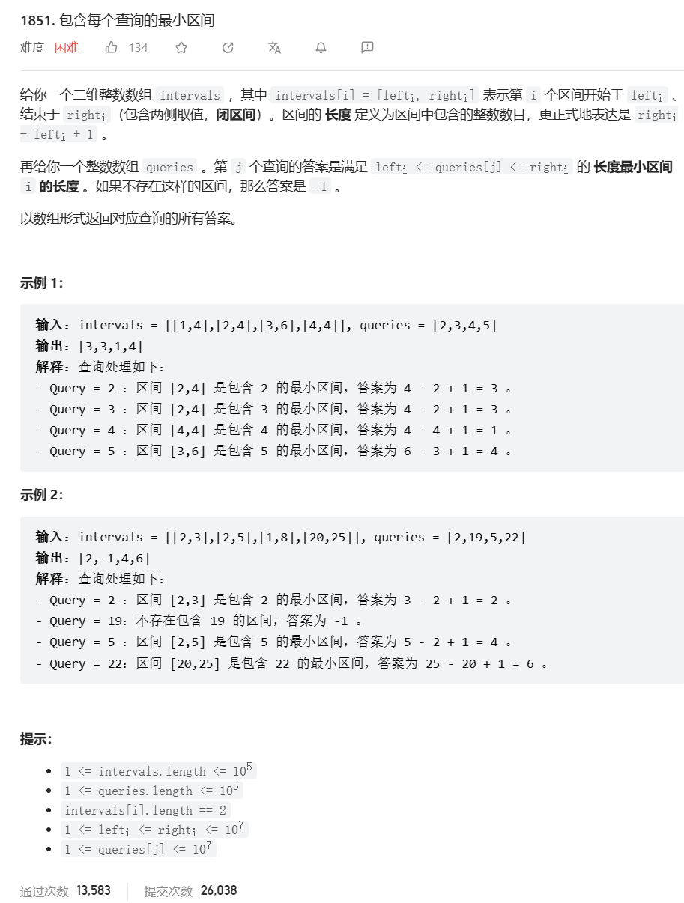
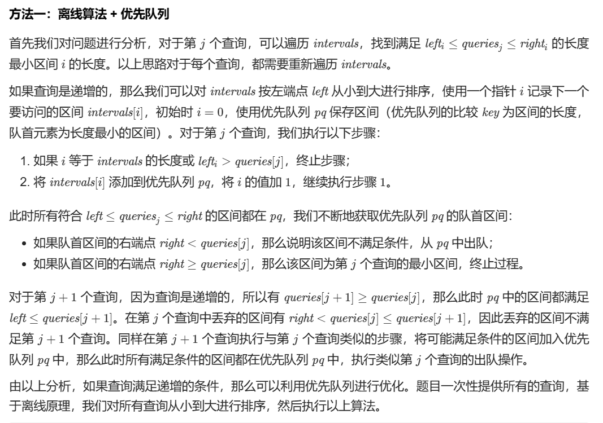

# 题目



# 我的题解

## 思路：


# 其他题解

## 其他1

### 思路：



```C++
class Solution {
public:
    vector<int> minInterval(vector<vector<int>>& intervals, vector<int>& queries) {
        vector<int> qindex(queries.size());
        iota(qindex.begin(), qindex.end(), 0);
        sort(qindex.begin(), qindex.end(), [&](int i, int j) -> bool {
            return queries[i] < queries[j];
        });
        sort(intervals.begin(), intervals.end(), [](const vector<int> &it1, const vector<int> &it2) -> bool {
            return it1[0] < it2[0];
        });
        priority_queue<vector<int>> pq;
        vector<int> res(queries.size(), -1);
        int i = 0;
        for (auto qi : qindex) {
            while (i < intervals.size() && intervals[i][0] <= queries[qi]) {
                int l = intervals[i][1] - intervals[i][0] + 1;
                pq.push({-l, intervals[i][0], intervals[i][1]});
                i++;
            }
            while (!pq.empty() && pq.top()[2] < queries[qi]) {
                pq.pop();
            }
            if (!pq.empty()) {
                res[qi] = -pq.top()[0];
            }
        }
        return res;
    }
};
```

