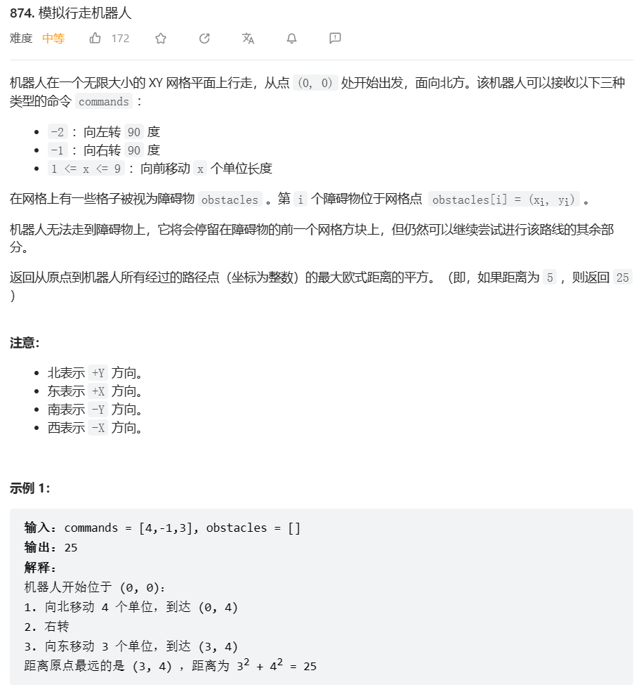
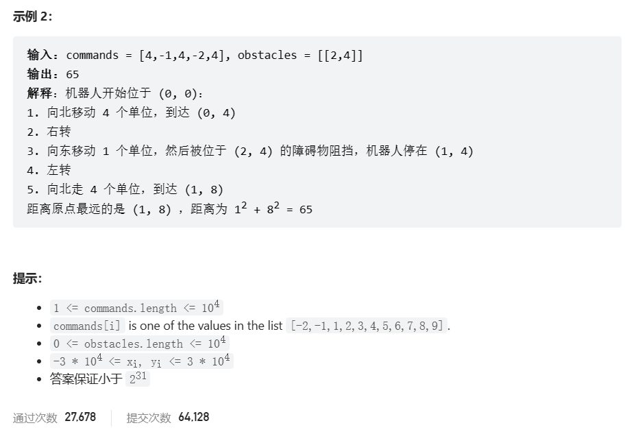
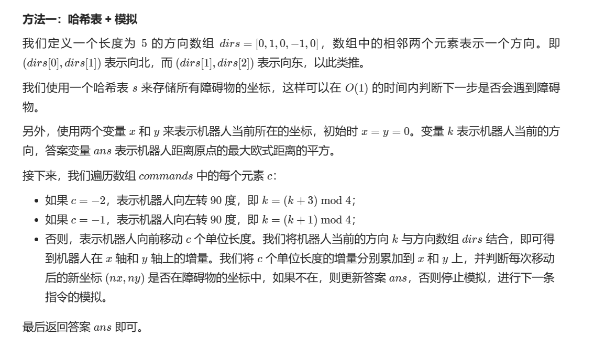

# 题目





# 我的题解

## 思路


```

```


# 其他题解

## 其他1

思路：模拟+哈希表



```C++
class Solution {
public:
    int robotSim(vector<int>& commands, vector<vector<int>>& obstacles) {
        int dirs[5] = {0, 1, 0, -1, 0};
        auto f = [](int x, int y) {
            return x * 60010 + y;
        };
        unordered_set<int> s;
        for (auto& e : obstacles) {
            s.insert(f(e[0], e[1]));
        }
        int ans = 0, k = 0;
        int x = 0, y = 0;
        for (int c : commands) {
            if (c == -2) {
                k = (k + 3) % 4;
            } else if (c == -1) {
                k = (k + 1) % 4;
            } else {
                while (c--) {
                    int nx = x + dirs[k], ny = y + dirs[k + 1];
                    if (s.count(f(nx, ny))) {
                        break;
                    }
                    x = nx;
                    y = ny;
                    ans = max(ans, x * x + y * y);
                }
            }
        }
        return ans;
    }
};
```

