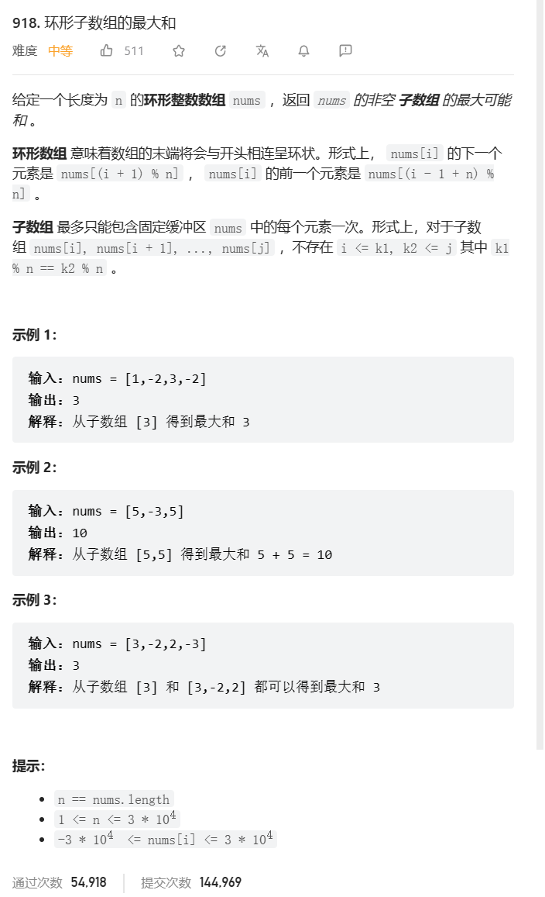
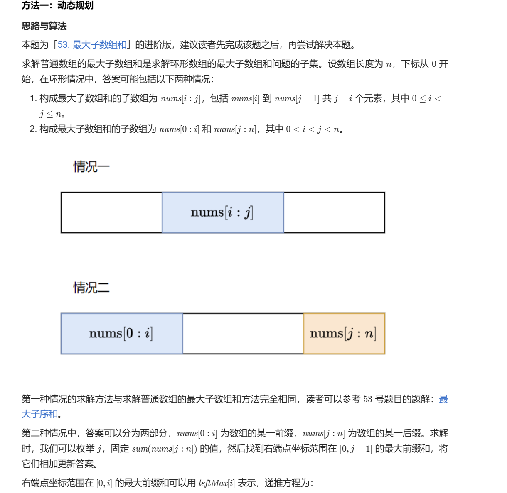
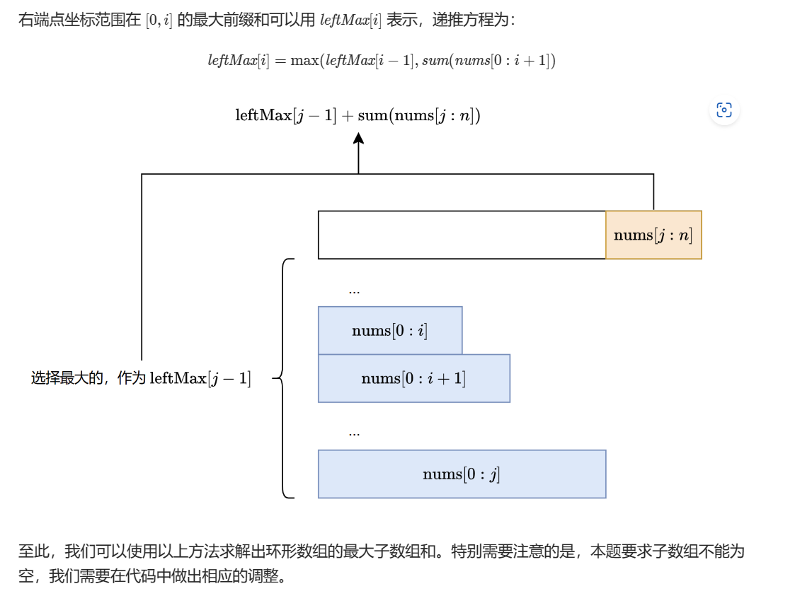

# 题目



# 我的题解


# 其他题解

## 其他1

### 思路：





```C++
class Solution {
public:
    int maxSubarraySumCircular(vector<int>& nums) {
        int n = nums.size();
        vector<int> leftMax(n);
        // 对坐标为 0 处的元素单独处理，避免考虑子数组为空的情况
        leftMax[0] = nums[0];
        int leftSum = nums[0];
        int pre = nums[0];
        int res = nums[0];
        for (int i = 1; i < n; i++) {
            pre = max(pre + nums[i], nums[i]);
            res = max(res, pre);
            leftSum += nums[i];
            leftMax[i] = max(leftMax[i - 1], leftSum);
        }

        // 从右到左枚举后缀，固定后缀，选择最大前缀
        int rightSum = 0;
        for (int i = n - 1; i > 0; i--) {
            rightSum += nums[i];
            res = max(res, rightSum + leftMax[i - 1]);
        }
        return res;
    }
};

```

