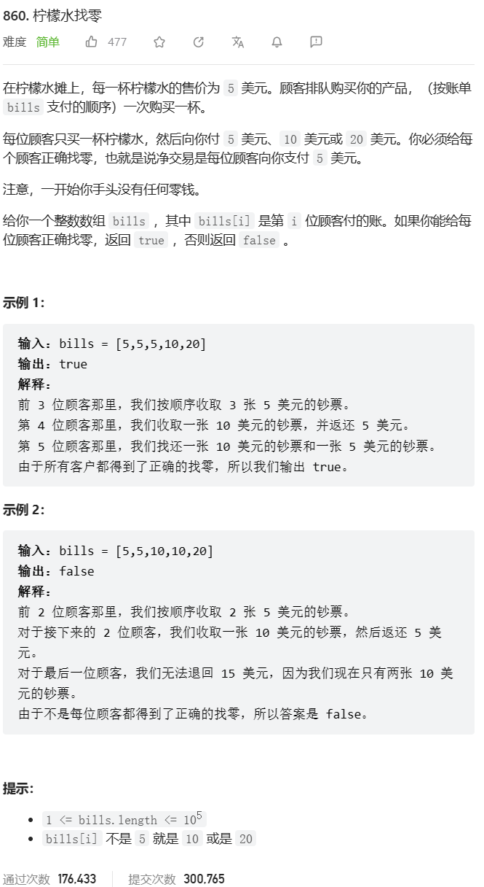
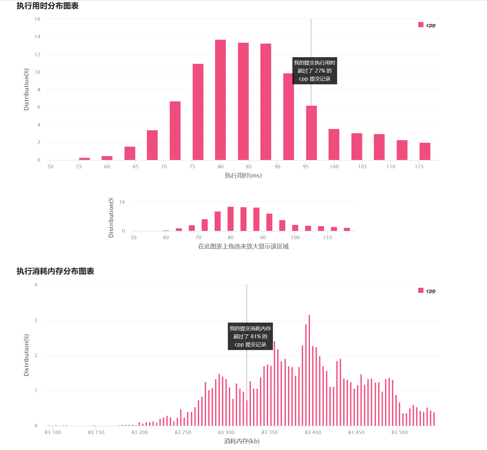
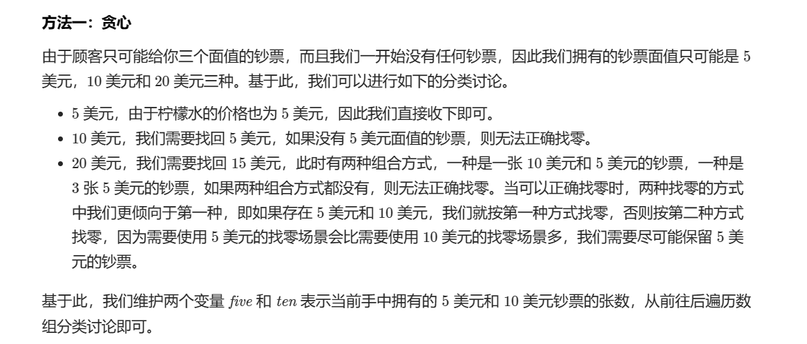

# 题目




# 我的题解

## 思路

### 模拟，类似贪心

有5块就存起来，然后遇到10块就找5块，遇到20块就找10块+5块，或者给3张五块

```C++
class Solution {
public:
    bool lemonadeChange(vector<int>& bills) {
        unordered_map<int,int> hash;
        hash[5] = 0, hash[10] = 0, hash[20] = 0;
        for(int i = 0; i < bills.size(); ++i){
            if(bills[i] == 5) hash[5]++;
            else if(bills[i] == 10) {
                if(hash[5] > 0) hash[5]--;
                else return false;
                hash[10]++;
            }
            else if(bills[i] == 20){
                if(hash[10] >= 1 && hash[5] >= 1){
                    hash[10]--,hash[5]--;
                    hash[20]++;
                }
                else if(hash[10] < 1 && hash[5] >= 3) {
                    hash[5] -= 3; 
                    hash[20]++;
                }
                else return false;
            }
        }
        return true;
    }
};
```



# 其他题解

## 其他1

### 思路：贪心



```C++
class Solution {
public:
    bool lemonadeChange(vector<int>& bills) {
        int five = 0, ten = 0;
        for (auto& bill: bills) {
            if (bill == 5) {
                five++;
            } else if (bill == 10) {
                if (five == 0) {
                    return false;
                }
                five--;
                ten++;
            } else {
                if (five > 0 && ten > 0) {
                    five--;
                    ten--;
                } else if (five >= 3) {
                    five -= 3;
                } else {
                    return false;
                }
            }
        }
        return true;
    } 
};
```

