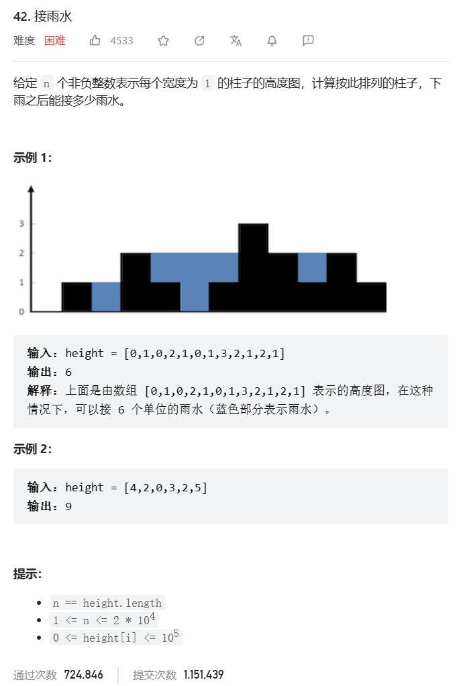

# 题目



# 我的题解

## 思路：双指针，但是需要提前优化

```C++
class Solution {
public:
    int trap(vector<int>& height) {
        //至少2个以上
        if(height.size()<=2) return 0;
        //双指针法，就是每次我们都去寻找左边和右边的最高，这样时间复杂度高了
        //我们可以事先维护2个数组，每个下标的左边和右边的高度数组
        int n=height.size();
        //每个下标i维护其左边最高高度
        vector<int>maxLeft(n,0);
        //右边最高高度
        vector<int>maxRight(n,0);
        //状态转移公式，维护最左边最大值,从1开始
        maxLeft[0]=height[0];
        for(int i=1;i<n;i++){
            //与i-1维护的最左边最大值比较
            maxLeft[i]=max(height[i],maxLeft[i-1]);
        }
        //记录每个柱子右边柱子的最大高度
        maxRight[n-1]=height[n-1];
        //从最右边开始遍历
        for(int i=n-2;i>=0;i--){
            maxRight[i]=max(height[i],maxRight[i+1]);
        }
        int res=0;
        //像双指针一样处理
        for(int i=0;i<n;i++){
            if(i==0||i==n-1)continue;//这句也可以去掉了，因为维护的高度最前面和最右边最低是0，不会影响
            int h=min(maxLeft[i],maxRight[i])-height[i];
            if(h>0)res+=h;//h*1,h不一定大于0，初始化没有是自己，之前一直是和自己比较
        }
        return res;
    }
};

//动态规划
/*
为了得到两边的最高高度，使用了双指针来遍历，每到一个柱子都向两边遍历一遍，这其实是有重复计算的。我们把每一个位置的左边最高高度记录在一个数组上（maxLeft），右边最高高度记录在一个数组上（maxRight）。这样就避免了重复计算，这就用到了动态规划。

当前位置，左边的最高高度是前一个位置的左边最高高度和本高度的最大值。

即从左向右遍历：maxLeft[i] = max(height[i], maxLeft[i - 1]);

从右向左遍历：maxRight[i] = max(height[i], maxRight[i + 1]);

这样就找到递推公式。

*/
```


# 其他题解

## 其他1

思路：单调栈

```C++
//非独立完成，单调栈解法。相同高度仍有处理。因为要计算宽度。

class Solution {
public:
    int trap(vector<int>& height) {
        if (height.size() <= 2) return 0; // 可以不加
        stack<int> st; // 存着下标，计算的时候用下标对应的柱子高度
        st.push(0);
        int sum = 0;
        for (int i = 1; i < height.size(); i++) {
            if (height[i] < height[st.top()]) {     // 情况一
                st.push(i);
            } if (height[i] == height[st.top()]) {  // 情况二
            //因为我们要求宽度的时候 如果遇到相同高度的柱子，需要使用最右边的柱子来计算宽度。
                st.pop(); // 其实这一句可以不加，效果是一样的，但处理相同的情况的思路却变了。
                st.push(i);//换最新的下标（虽然数值相同）
            } else {                                // 情况三
                while (!st.empty() && height[i] > height[st.top()]) { // 注意这里是while
                    int mid = st.top();//凹槽
                    st.pop();//必须先弹出，然后栈顶就是左边的高度
                    if (!st.empty()) {
                        int h = min(height[st.top()], height[i]) - height[mid];
                        int w = i - st.top() - 1; // 注意减一，只求中间宽度（重要）
                        sum += h * w;
                    }
                }
                st.push(i);
            }
        }
        return sum;
    }
};

/*
1.（很重要）首先单调栈是按照行方向来计算雨水，如图

2.使用单调栈内元素的顺序
从大到小还是从小到大呢？

从栈头（元素从栈头弹出）到栈底的顺序应该是从小到大的顺序。

因为一旦发现添加的柱子高度大于栈头元素了，此时就出现凹槽了，（说明是找第一个大的元素值，
栈顶到栈底递增顺序）
栈头元素就是凹槽底部的柱子，栈头第二个元素就是凹槽左边的柱子，而添加的元素就是凹槽右边的柱子。
*/

```

