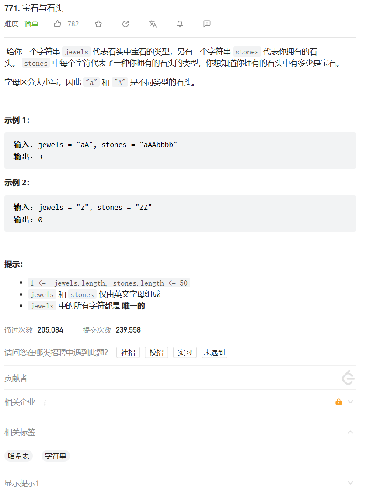
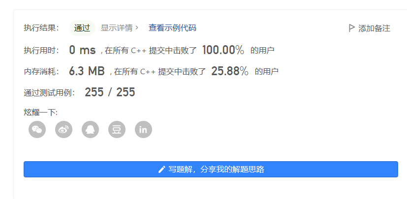
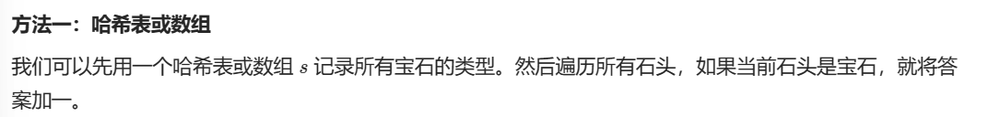

# 题目



# 我的题解

## 思路：哈希表

```C++
class Solution {
public:
    int numJewelsInStones(string jewels, string stones) {
        unordered_map<char,int> hash;
        int ret = 0;
        for (int i = 0; i < jewels.size(); ++i){
            hash[jewels[i]]++;
        }
        for (int i = 0; i < stones.size(); ++i){
            if(hash.count(stones[i])){
                ret++;
            }   
        }
        return ret;
    }
};
```




# 其他题解

## 其他1

### 暴力

```C++
class Solution {
public:
    int numJewelsInStones(string jewels, string stones) {
        int jewelsCount = 0;
        int jewelsLength = jewels.length(), stonesLength = stones.length();
        for (int i = 0; i < stonesLength; i++) {
            char stone = stones[i];
            for (int j = 0; j < jewelsLength; j++) {
                char jewel = jewels[j];
                if (stone == jewel) {
                    jewelsCount++;
                    break;
                }
            }
        }
        return jewelsCount;
    }
};
```

## 其他2

### 思路：哈希集合

```C++
class Solution {
public:
    int numJewelsInStones(string jewels, string stones) {
        int jewelsCount = 0;
        unordered_set<char> jewelsSet;
        int jewelsLength = jewels.length(), stonesLength = stones.length();
        for (int i = 0; i < jewelsLength; i++) {
            char jewel = jewels[i];
            jewelsSet.insert(jewel);
        }
        for (int i = 0; i < stonesLength; i++) {
            char stone = stones[i];
            if (jewelsSet.count(stone)) {
                jewelsCount++;
            }
        }
        return jewelsCount;
    }
};


```

## 其他3

### 思路：数组



```
class Solution {
public:
    int numJewelsInStones(string jewels, string stones) {
        int s[128] = {0};
        for (char c : jewels) s[c] = 1;
        int ans = 0;
        for (char c : stones) ans += s[c];
        return ans;
    }
};

```


