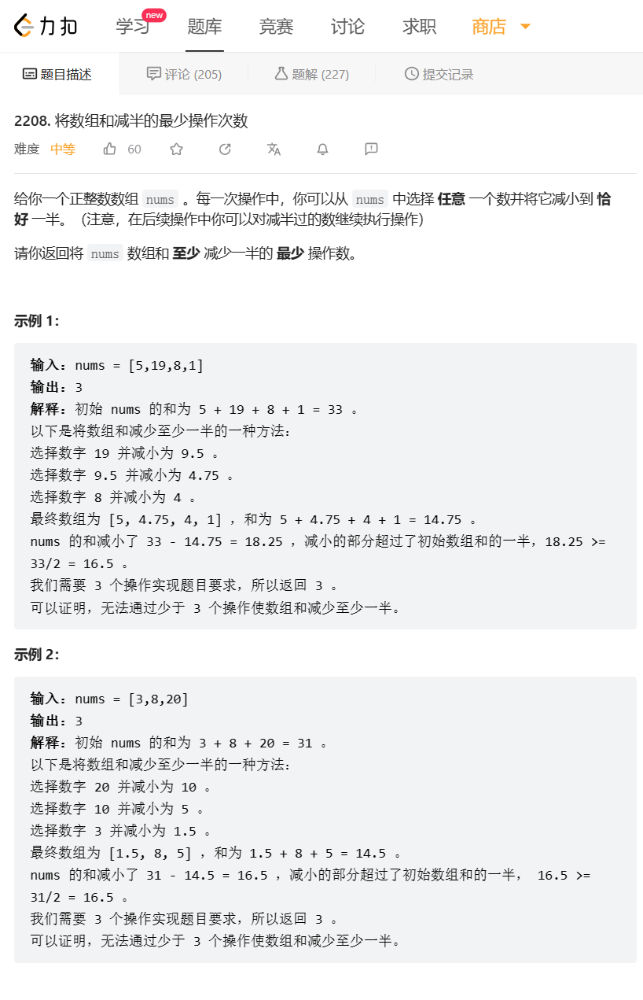

# 题目



# 我的题解

思路：


# 其他题解

## 其它1

### 思路：优先队列+贪心

```C++
class Solution {
public:
    int halveArray(vector<int>& nums) {
        priority_queue<double> pq(nums.begin(), nums.end());
        int res = 0;
        double sum = accumulate(nums.begin(), nums.end(), 0.0), sum2 = 0.0;
        while (sum2 < sum / 2) {
            double x = pq.top();
            pq.pop();
            sum2 += x / 2;
            pq.push(x / 2);
            res++;
        }
        return res;
    }
};

```

