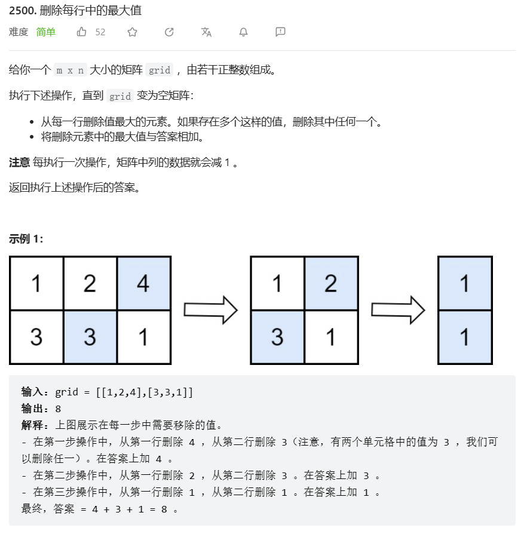

# 题目



# 我的题解

总共列数次循环，每次循环删除每行的最大值，且得出最后每行的最大值中的最大值。使用sort（）快速排序，加pop_back(),v.back()等api。第323周赛第一题 删除每行中的最大值

```C++
class Solution {
public:
    int deleteGreatestValue(vector<vector<int>>& grid) {
        int m = grid.size();
        int n = grid[0].size();
        int res = 0;
        while (n--){
            int temp = INT_MIN;
        for (int i = 0; i < m; i++)
        {
            sort(grid[i].begin(), grid[i].end());
            temp = max(temp,grid[i].back());
            grid[i].pop_back();
        }
        res += temp;
        }
        return res;
    }
};
```


# 其他题解

## 其他1

思路：排序

```C++
class Solution {
public:
    int deleteGreatestValue(vector<vector<int>>& grid) {
        int m = grid.size(), n = grid[0].size();
        for (int i = 0; i < m; i++) {
            sort(grid[i].begin(), grid[i].end());
        }
        int res = 0;
        for (int j = 0; j < n; j++) {
            int mx = 0;
            for (int i = 0; i < m; i++) {
                mx = max(mx, grid[i][j]);
            }
            res += mx;
        }
        return res;
    }
};

```

