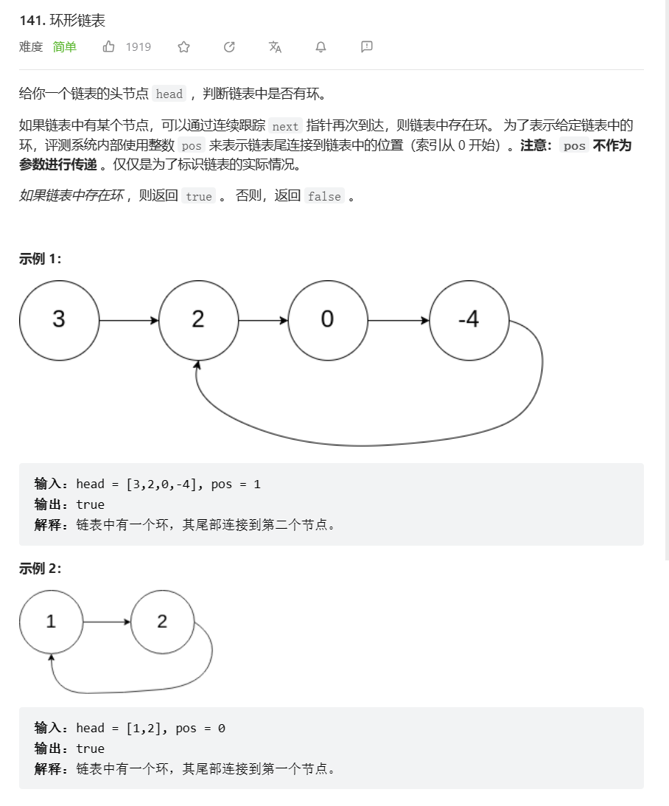
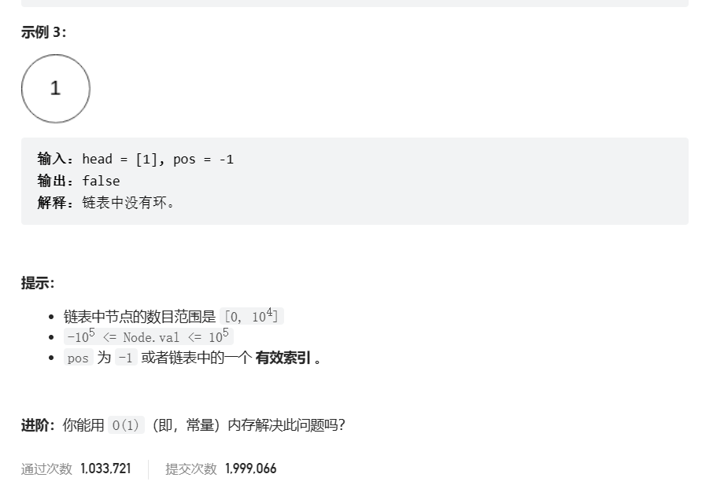

# 题目





# 我的题解

思路：双指针(快慢指针)

但是需要去确定判断链表节点的判定条件


# 其他题解

## 其他1

```C++
/**
 * Definition for singly-linked list.
 * struct ListNode {
 *     int val;
 *     ListNode *next;
 *     ListNode(int x) : val(x), next(NULL) {}
 * };
 */

class Solution {
public:
    bool hasCycle(ListNode* head) {
        if (head == nullptr || head->next == nullptr) {
            return false;
        }
        ListNode* slow = head;
        ListNode* fast = head->next;
        while (slow != fast) {
            if (fast == nullptr || fast->next == nullptr) {
                return false;
            }
            slow = slow->next;
            fast = fast->next->next;
        }
        return true;
    }
};
//快慢指针
```

