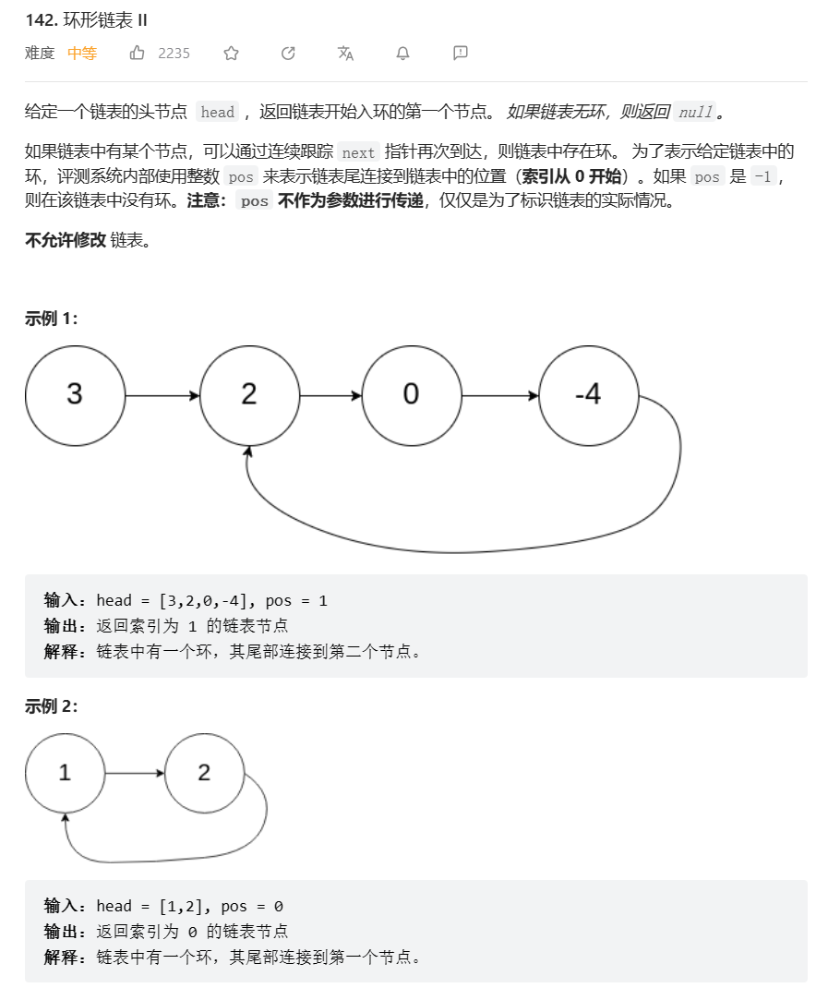

# 题目




# 我的题解

```C++
/**
 * Definition for singly-linked list.
 * struct ListNode {
 *     int val;
 *     ListNode *next;
 *     ListNode(int x) : val(x), next(NULL) {}
 * };
 */
class Solution {
public:
    ListNode *detectCycle(ListNode *head) {
        ListNode* fast=head;
		ListNode* slow=head;//定义快慢指针，有推导过程，推出x=z,x为起点到环入口距离，z为环中相遇点到入口距离
		ListNode* index1=nullptr;
		ListNode* index2=nullptr;
		while (fast != nullptr && fast->next != nullptr)//可以一直向后移动
		{
			fast = fast->next->next;//快指针向后每次移动2格
			slow = slow->next;
			if (fast == slow)
			//相遇点
			{//x=z,此时不用快慢指针了，单纯比较距离
				index1 = fast;
				index2 = head;//重新定义2个指针，index1在相遇点，index2在起点，两者开始向后移动，速度为1相同
				break;
			}
		}
		while (index1!= index2)
		{
			index1 = index1->next;;
			index2 = index2->next;
		}//不成立后则可以返回
		return index1;
    }
};
```


# 其他题解

## 其他1


```C++
class Solution {
public:
    ListNode *detectCycle(ListNode *head) {
        unordered_set<ListNode *> visited;
        while (head != nullptr) {
            if (visited.count(head)) {
                return head;
            }
            visited.insert(head);
            head = head->next;
        }
        return nullptr;
    }
};

```

