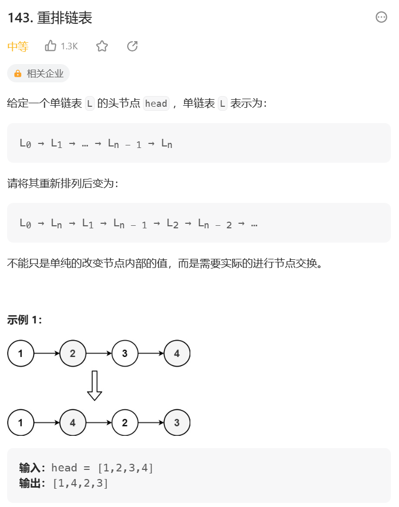
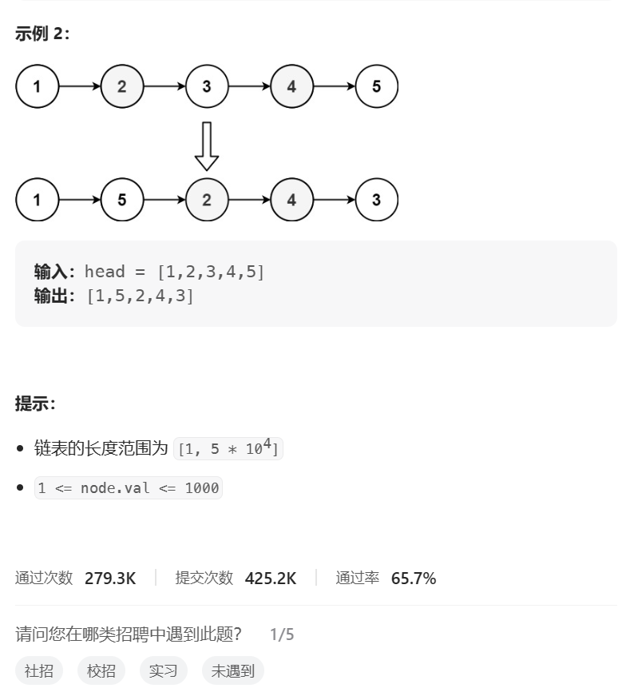
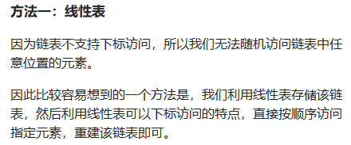
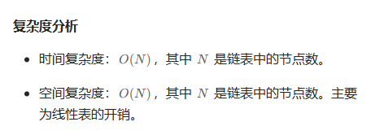
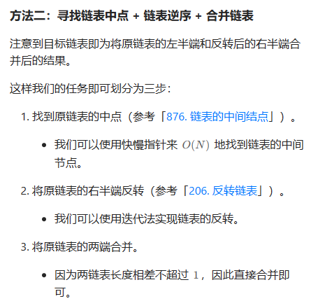

# 题目





# 我的题解

### 思路1：使用线性表存储

```C++
/**
 * Definition for singly-linked list.
 * struct ListNode {
 *     int val;
 *     ListNode *next;
 *     ListNode() : val(0), next(nullptr) {}
 *     ListNode(int x) : val(x), next(nullptr) {}
 *     ListNode(int x, ListNode *next) : val(x), next(next) {}
 * };
 */
class Solution {
public:
    void reorderList(ListNode* head) {
        if (head == nullptr){
            return;
        }
        //使用线性表储存该链表，因为链表不支持随机访问
        vector<ListNode*> vec;
        ListNode *node = head;
        while (node != nullptr){
            vec.emplace_back(node);
            node = node->next;
        }
        int i = 0, j = vec.size() - 1;
        while (i < j){
            vec[i]->next = vec[j];
            i++;
            //终止条件  适用于是奇数和偶数  因为我们是先前面 i ++
            if (i == j){
                break;
            }
            vec[j]->next = vec[i];
            j--;
        }
        //前面头已经遍历完了  或者相当于 i = j了
        vec[i]->next = nullptr;
    }
};
```

## 思路2:找到中点，反转l2链表，合并l1 ,l2 

很重点


# 其他题解

## 其他1



```
class Solution {
public:
    void reorderList(ListNode *head) {
        if (head == nullptr) {
            return;
        }
        vector<ListNode *> vec;
        ListNode *node = head;
        while (node != nullptr) {
            vec.emplace_back(node);
            node = node->next;
        }
        int i = 0, j = vec.size() - 1;
        while (i < j) {
            vec[i]->next = vec[j];
            i++;
            if (i == j) {
                break;
            }
            vec[j]->next = vec[i];
            j--;
        }
        vec[i]->next = nullptr;
    }
};

作者：力扣官方题解
链接：https://leetcode.cn/problems/reorder-list/solutions/452867/zhong-pai-lian-biao-by-leetcode-solution/
来源：力扣（LeetCode）
著作权归作者所有。商业转载请联系作者获得授权，非商业转载请注明出处。
```



## 其他2



```C++
class Solution {
public:
    void reorderList(ListNode* head) {
        if (head == nullptr) {
            return;
        }
        ListNode* mid = middleNode(head);
        ListNode* l1 = head;
        ListNode* l2 = mid->next;
        mid->next = nullptr;
        l2 = reverseList(l2);
        mergeList(l1, l2);
    }
	
    //快慢指针   快的是慢的2倍，快的到达nullptr,慢的到达中点
    ListNode* middleNode(ListNode* head) {
        ListNode* slow = head;
        ListNode* fast = head;
        while (fast->next != nullptr && fast->next->next != nullptr) {
            slow = slow->next;
            fast = fast->next->next;
        }
        return slow;
    }

    //反转链表
    ListNode* reverseList(ListNode* head) {
        ListNode* prev = nullptr;
        ListNode* curr = head;
        while (curr != nullptr) {
            ListNode* nextTemp = curr->next;
            curr->next = prev;
            prev = curr;
            curr = nextTemp;
        }
        return prev;
    }
	
    //合并链表
    //l1 l2 相互交错着合并
    void mergeList(ListNode* l1, ListNode* l2) {
        ListNode* l1_tmp;
        ListNode* l2_tmp;
        while (l1 != nullptr && l2 != nullptr) {
            //预先存下l1 ，l2的下一个节点
            l1_tmp = l1->next;
            l2_tmp = l2->next;
			
            //修改l1的下一个节点为l2
            l1->next = l2;
            //1l指针再指向之前的下一个l1
            l1 = l1_tmp;
			
            //修改l2指向之前l1的下一个节点
            l2->next = l1;
            //l2再指向先前的l2的下一个节点
            l2 = l2_tmp;
        }
    }
};

作者：力扣官方题解
链接：https://leetcode.cn/problems/reorder-list/solutions/452867/zhong-pai-lian-biao-by-leetcode-solution/
来源：力扣（LeetCode）
著作权归作者所有。商业转载请联系作者获得授权，非商业转载请注明出处。
```

