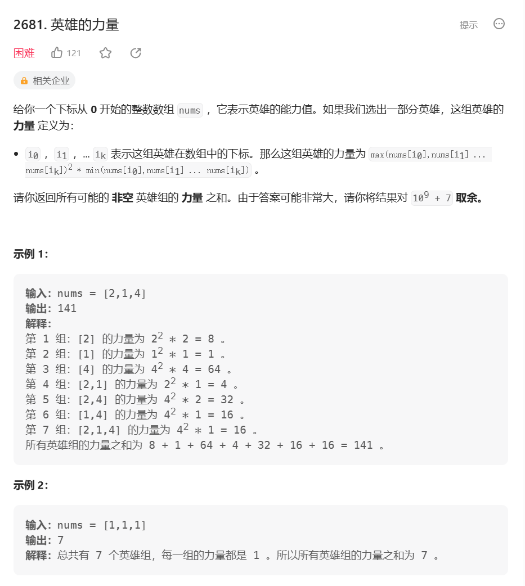
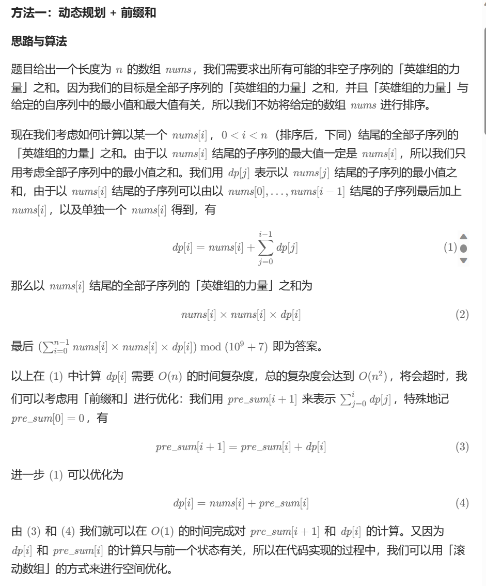

# 题目



# 我的题解


# 其他题解

## 其他1



```c++
class Solution {
public:
    int sumOfPower(vector<int>& nums) {
        int n = nums.size();
        sort(nums.begin(), nums.end());
        vector<int> dp(n);
        vector<int> preSum(n + 1);
        int res = 0, mod = 1e9 + 7;
        for (int i = 0; i < n; i++) {
            dp[i] = (nums[i] + preSum[i]) % mod;
            preSum[i + 1] = (preSum[i] + dp[i]) % mod;
            res = (int) ((res + (long long) nums[i] * nums[i] % mod * dp[i]) % mod);
            if (res < 0) {
                res += mod;
            }
        }
        return res;
    }
};

```

