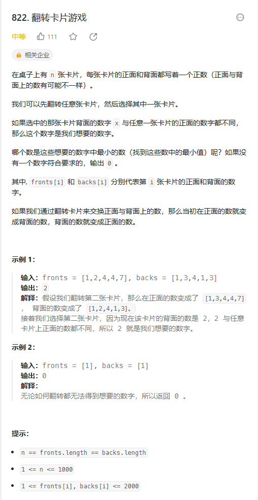
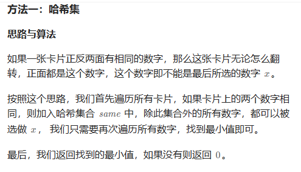

# 题目



# 我的题解

## 思路：

题目说的有点绕：可以改一下

**假设给你两个数组A,B。A,B的长度是相同的，你可以任意更换`相同下标`的两个数，这个时候A,B的数组就会发生变化，请问你是否能在B数组中找到一个最小值，这个最小值不在A数组中出现，如果存在请返回这个最小值，如果不存在请返回0。**

```
class Solution {
public:
    int flipgame(vector<int>& fronts, vector<int>& backs) {
        //先梳理下逻辑，我们是想找到背面的一个数字，与其他正面的数字都不相同，且希望这个数字是最小的
        //在选择这个数字之前，我们是可以翻转其他卡片的
        
    }
};
```

暂时没有思路

**看了题解后写的，这个可以翻转任意次，代表我们可以理想的找到最小值，而不重复，但是我们必须先要剔除一些我们翻转后，仍然会重复的，就是正反两面相同的数字**

```C++
class Solution {
public:
    int flipgame(vector<int>& fronts, vector<int>& backs) {
        //先梳理下逻辑，我们是想找到背面的一个数字，与其他正面的数字都不相同，且希望这个数字是最小的
        //在选择这个数字之前，我们是可以翻转其他卡片的
        unordered_set<int> hash;
        for (int i = 0; i < fronts.size(); i++){
            if(fronts[i] == backs[i]){
                hash.insert(fronts[i]);
            }
        }
        int res = 1001;
        for (int &i : fronts){
            if (!hash.count(i)){
                res = min(res,i);
            }
        }
        for (int &i : backs){
            if (!hash.count(i)){
                res = min(res,i);
            }
        }
        return res == 1001 ? 0 : res;
    }
};
```


# 其他题解

## 其他1

首先明确，如果A和B数组（卡片正反面都相同的话）,则该数就不会选择，然后我们依次遍历A数组，和B数组

找出最小值，为什么这样我们就可以得到最小值呢


==那是因为我们可以不断翻转，使得这个数字最小，其他的也不会与他重复==



```C++
class Solution {
public:
    int flipgame(vector<int>& fronts, vector<int>& backs) {
        int res = 3000, n = fronts.size();
        unordered_set<int> same;
        for (int i = 0; i < n; ++i) {
            if (fronts[i] == backs[i]) {
                same.insert(fronts[i]);
            }
        }
        for (int &x : fronts) {
            if (x < res && same.count(x) == 0) {
                res = x;
            }
        }
        for (int &x : backs) {
            if (x < res && same.count(x) == 0) {
                res = x;
            }
        }
        return res % 3000;
    }
};

作者：力扣官方题解
链接：https://leetcode.cn/problems/card-flipping-game/solutions/2365854/fan-zhuan-qia-pian-you-xi-by-leetcode-so-acbj/
来源：力扣（LeetCode）
著作权归作者所有。商业转载请联系作者获得授权，非商业转载请注明出处。
```

