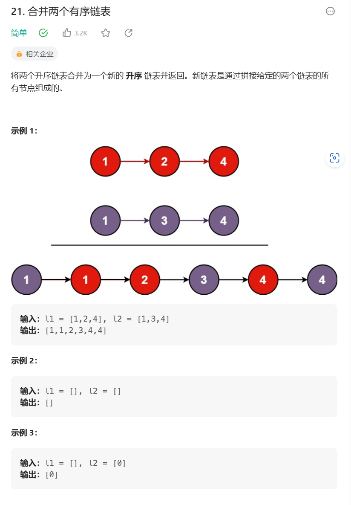

# 题目



# 我的题解

## 思路：迭代法


```C++
/**
 * Definition for singly-linked list.
 * struct ListNode {
 *     int val;
 *     ListNode *next;
 *     ListNode() : val(0), next(nullptr) {}
 *     ListNode(int x) : val(x), next(nullptr) {}
 *     ListNode(int x, ListNode *next) : val(x), next(next) {}
 * };
 */
class Solution {
public:
    ListNode* mergeTwoLists(ListNode* l1, ListNode* l2) {
        ListNode* preHead = new ListNode(-1);

        ListNode* prev = preHead;
        while (l1 != nullptr && l2 != nullptr) {
            if (l1->val < l2->val) {
                prev->next = l1;
                l1 = l1->next;
            } else {
                prev->next = l2;
                l2 = l2->next;
            }
            prev = prev->next;
        }

        // 合并后 l1 和 l2 最多只有一个还未被合并完，我们直接将链表末尾指向未合并完的链表即可
        prev->next = l1 == nullptr ? l2 : l1;

        return preHead->next;
    }
};

```

```C++
/**
 * Definition for singly-linked list.
 * struct ListNode {
 *     int val;
 *     ListNode *next;
 *     ListNode() : val(0), next(nullptr) {}
 *     ListNode(int x) : val(x), next(nullptr) {}
 *     ListNode(int x, ListNode *next) : val(x), next(next) {}
 * };
 */
class Solution {
public:
	ListNode* mergeTwoLists(ListNode* l1, ListNode* l2)
	{
		ListNode* head;//头指针
		ListNode dummy(-1);//头结点
		head = &dummy;//头指针指向头结点
		while (l1 != nullptr && l2 != nullptr)//l1,l2为链表头指针，链表都是用头指针来得到链表信息的
		{
			if (l1->val < l2->val)
			{
				head->next = l1;//以前head直接相当于头指针然后指向第一个节点，现在多了一个哑结点
				//我们用哑结点的next类似于头指针
				//现在的头指针为l1，说明连接到l1了，其实这里的l1就是第一个节点，l1作为头指针已经指向第一个节点了
				l1 = l1->next;//进入第二个节点

			}
			else
			{
				head->next = l2;
				l2 = l2->next;
			}
			//链表需要串起来,要不然只有l1，l2在往后走
			head = head->next;
		}
		head->next = l1 == nullptr ? l2 : l1;//l1为空就接到l2，l1不为空就接到l1
		//直接将l1或l2赋值给了最终链表好像
		return dummy.next;//head指向dummy来操控，最终返回的还是指向第一个节点的指针，头指针指向哑结点了，所以不能返回头指针
		
	}
};
```

