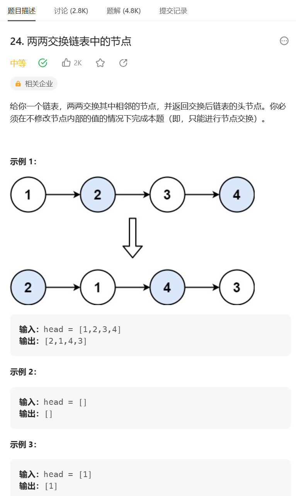

# 题目



# 我的题解

### 思路：模拟

独立完成，小看了一下之前的思路，操作还是自己来写的，主要是一个模拟的过程，保证后面有2个节点才行动，都是使用哑结点性质的前一个节点来操作。

```C++
/**
 * Definition for singly-linked list.
 * struct ListNode {
 *     int val;
 *     ListNode *next;
 *     ListNode() : val(0), next(nullptr) {}
 *     ListNode(int x) : val(x), next(nullptr) {}
 *     ListNode(int x, ListNode *next) : val(x), next(next) {}
 * };
 */
class Solution {
public:
    ListNode* swapPairs(ListNode* head) {
        //定义一个哑结点 储存头  链表
        ListNode *dummy = new ListNode(0);
        dummy->next = head;
        ListNode *cur = dummy;
        //ListNode* temp = dummy;
        ListNode *temp1 = nullptr;//记录断开前的2指向的3节点
        ListNode *temp2 = nullptr;//记录断开前的1节点
        while (cur->next && cur->next->next){
            //记录断开前节点信息
            temp1 = cur->next->next->next;
            temp2 = cur->next;
            //开始调换  只操作前2个
            cur->next = cur->next->next;//2调到前面
            cur->next->next = temp2;//2指向1
            cur->next->next->next = temp1;//1指向3
            //完成后，跳转到第三个节点的前一个节点，我们都是使用哑结点性质来操作
            cur = cur->next->next;
        }
        return dummy->next;
    }
};
```


# 其他题解

## 其他1

迭代 

还释放了哑结点的内存空间，思路和我之前写的一样

```C++
class Solution {
public:
    ListNode* swapPairs(ListNode* head) {
        ListNode* dummyHead = new ListNode(0);
        dummyHead->next = head;
        ListNode* temp = dummyHead;
        while (temp->next != nullptr && temp->next->next != nullptr) {
            ListNode* node1 = temp->next;
            ListNode* node2 = temp->next->next;
            temp->next = node2;
            node1->next = node2->next;
            node2->next = node1;
            temp = node1;
        }
        ListNode* ans = dummyHead->next;
        delete dummyHead;
        return ans;
    }
};

作者：力扣官方题解
链接：https://leetcode.cn/problems/swap-nodes-in-pairs/solutions/444474/liang-liang-jiao-huan-lian-biao-zhong-de-jie-di-91/
来源：力扣（LeetCode）
著作权归作者所有。商业转载请联系作者获得授权，非商业转载请注明出处。
```

## 其他2

递归

```C++
class Solution {
public:
    ListNode* swapPairs(ListNode* head) {
        if (head == nullptr || head->next == nullptr) {
            return head;
        }
        ListNode* newHead = head->next;
        head->next = swapPairs(newHead->next);
        newHead->next = head;
        return newHead;
    }
};

作者：力扣官方题解
链接：https://leetcode.cn/problems/swap-nodes-in-pairs/solutions/444474/liang-liang-jiao-huan-lian-biao-zhong-de-jie-di-91/
来源：力扣（LeetCode）
著作权归作者所有。商业转载请联系作者获得授权，非商业转载请注明出处。
```

