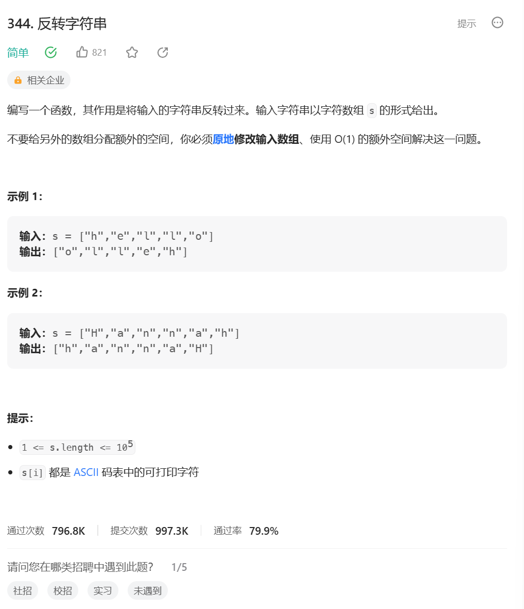

# 题目



# 我的题解

## 思路：

### 双指针遍历

```C++
class Solution {
public:
    void reverseString(vector<char>& s) {
        int left=0,right=s.size()-1;
        while(left<right){
            char temp=s[left];
            s[left]=s[right];
            s[right]=temp;
            left++;
            right--;
        }
        return;
    }
};
```


# 其他题解

## 其他1

代码随想录

```C++
class Solution {
public:
    void reverseString(vector<char>& s) {
        for (int i = 0, j = s.size() - 1; i < s.size()/2; i++, j--) {
            swap(s[i],s[j]);
        }
        //swap一种实现方式
        //s[i] ^= s[j];
       //s[j] ^= s[i];
       //s[i] ^= s[j];
    }
};
```

