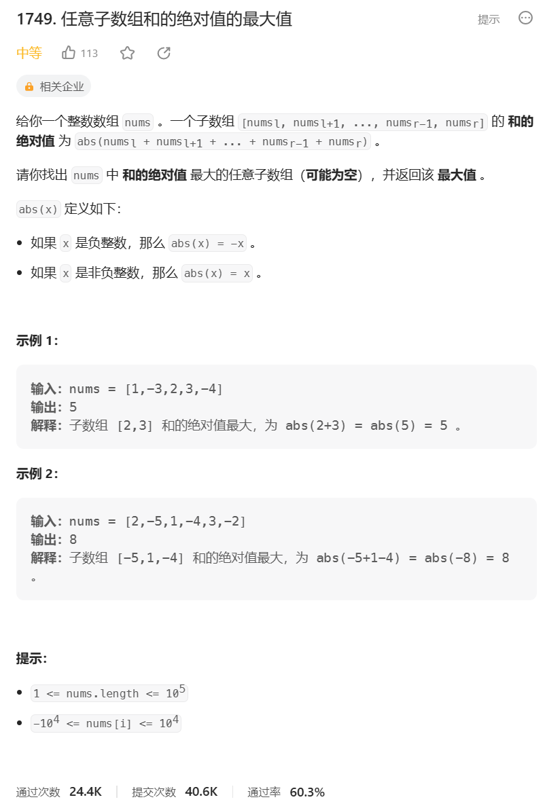
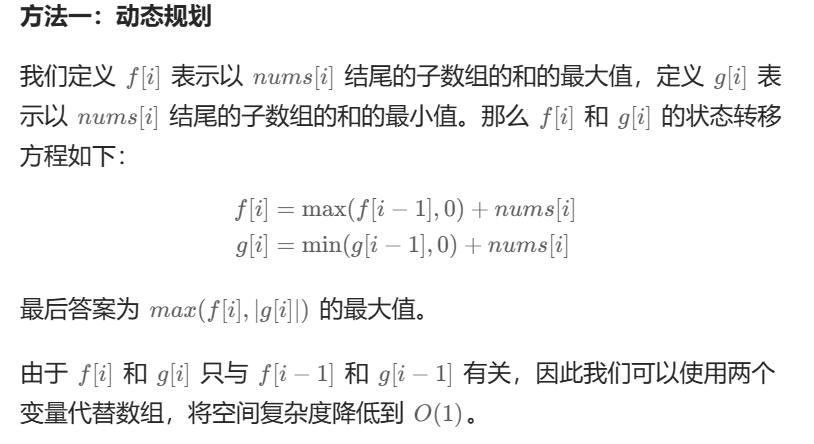
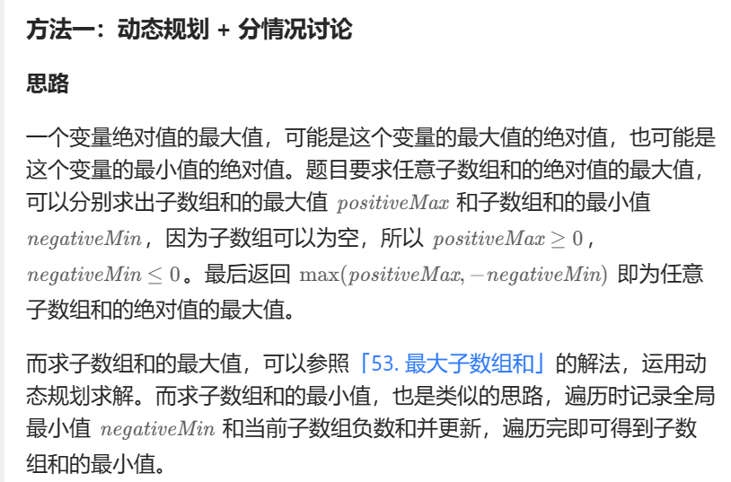

# 题目



# 我的题解

## 思路

第一个思路就是暴力求解出所有的子数组，求出其绝对值，进行比较。

如果是暴力的，应该会使用到深搜，回溯这些

并且子数组是一种组合形式，不是排列。

==注意子数组是连续的数列==

==子序列是可以不连续的==


最终自己没有解出来


# 其他题解

## 其他1

```C++
class Solution {
    public int maxAbsoluteSum(int[] nums) {
        //贪心 + 前缀和思想
        int sum = 0, max = 0, min = 0;
        for(int val : nums)
        {
            sum += val;
            if(sum > max) max = sum;
            else if(sum < min) min = sum;
        }
        return max - min;
    }
}
```

FYI: 关键点在于：[i, j]区间的和等于prefixSum[j] - prefixSum[i - 1]，如果求最值的话有两种情况，

1. 以i结尾区间最小值：prefixSum[i] - max(prefixSum[0:(i -1)])
2. 以i结尾区间最大值：prefixSum[i] - min(prefixSum[0:(i -1)]) 求绝对值最大就是求最值，所以记录三个变量，前缀和，前缀和最大值和最小值，就能得出答案了


代码维护了两个变量 max 和 min，它们分别表示数组的累计和的最大值和最小值。因为绝对值的性质，希望在计算最大绝对和时，使得正数的累计和尽可能大，负数的累计和尽可能小。

所以返回 max - min 时，实际上就是在计算了数组中的一个子数组，使得其中正数和最大、负数和最小，从而得到这个子数组的最大绝对和。


## 其他2



```C++
class Solution {
public:
    int maxAbsoluteSum(vector<int>& nums) {
        int f = 0, g = 0;
        int ans = 0;
        for (int& x : nums) {
            f = max(f, 0) + x;
            g = min(g, 0) + x;
            ans = max({ans, f, abs(g)});
        }
        return ans;
    }
};


```

## 其他3



```C++
class Solution {
public:
    int maxAbsoluteSum(vector<int>& nums) {
        int positiveMax = 0, negativeMin = 0;
        int positiveSum = 0, negativeSum = 0;
        for (int num : nums) {
            positiveSum += num;
            positiveMax = max(positiveMax, positiveSum);
            positiveSum = max(0, positiveSum);
            negativeSum += num;
            negativeMin = min(negativeMin, negativeSum);
            negativeSum = min(0, negativeSum);
        }
        return max(positiveMax, -negativeMin);
    }
};

```

