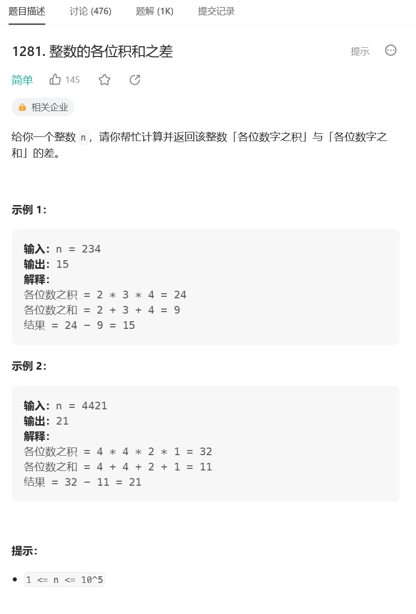
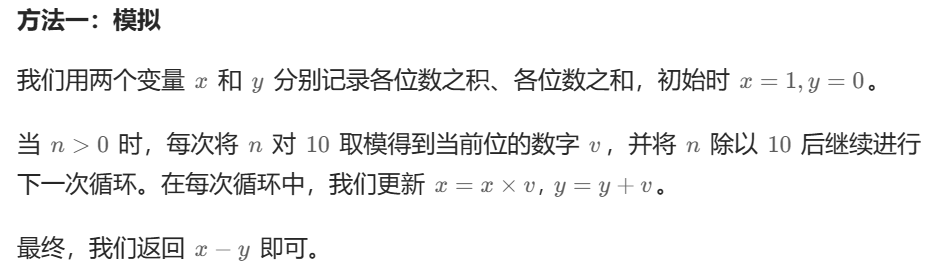

# 题目



# 我的题解

### 思路：

模拟，整数编程字符串来做

```C++
class Solution {
public:
    int subtractProductAndSum(int n) {
        //转化为字符串求
        string str = to_string(n);
        int sum = 0, multify = 1;
        for (int i = 0; i < str.size(); ++i){
            sum += str[i] - '0';
            multify *= str[i] - '0';
        }
        return multify - sum;
    }
};
```


或者从数字末尾开始一个数字一个数字求

```C++
class Solution {
public:
    int subtractProductAndSum(int n) {
        int sum = 0, multify = 1;
        while(n){
            int temp = n%10;
            sum += temp;
            multify *= temp;
            n /= 10; 
        }
        return multify - sum;
    }
};
```


# 其他题解

## 其他1



```C++
class Solution {
public:
    int subtractProductAndSum(int n) {
        int x = 1, y = 0;
        for (; n; n /= 10) {
            int v = n % 10;
            x *= v;
            y += v;
        }
        return x - y;
    }
};

```

