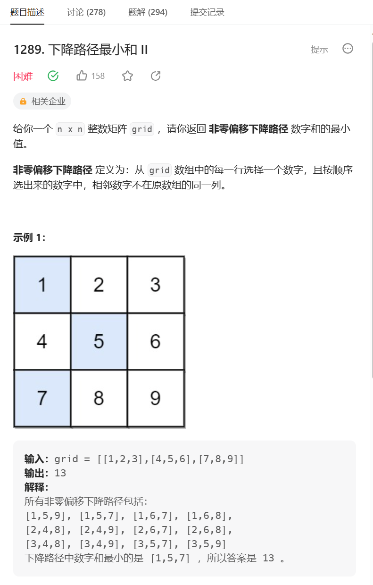
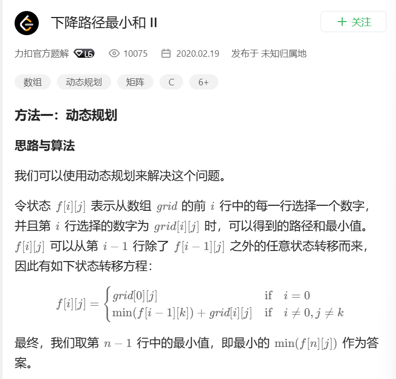
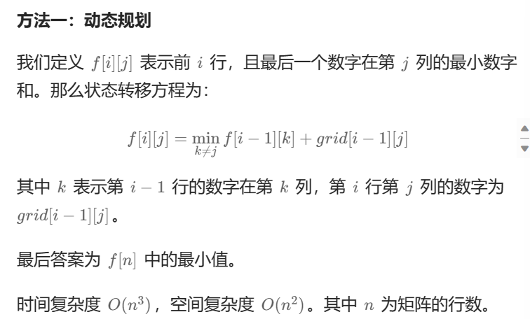

# 题目



# 我的题解

### 思路：动态规划

注意点:为什么需要第三层的for k循环呢，主要是我们得寻找到i-1行中那个k dp[i] [k-1] + grid[i] [j] 会得到最小值，

并且j的选择也不是固定的，for j 和 for k都是为了得到一个最佳（最小）的匹配结果

```C++
class Solution {
public:
    int minFallingPathSum(vector<vector<int>>& grid) {
        int n = grid.size();
        //动态规划，定义dp数组
        //dp[i][j]定义为以第i行为结尾，选第j列（grid[i][j]）的最小值
        vector<vector<int>> dp(n, vector<int>(n, INT_MAX));
        //i = 0时，dp[0][j] = grid[0][j];
        //初始化
        for (int i = 0; i < n; i++){
            dp[0][i] = grid[0][i]; 
        }
        //遍历
        for (int i = 1; i < n; i++){
            for (int j = 0; j < n; j++){
                //i > 0, dp[i][j] = min(dp[i-1][k]) + grid[i][j];   k != j
                for (int k = 0; k < n; k++){
                    if (k == j){
                        continue;
                    }
                    dp[i][j] = min(dp[i][j], dp[i-1][k] + grid[i][j]);
                }
            }
        }
        int res = INT_MAX;
        //还需要返回dp最后一行选择哪个j是最小的，因为选择不同的j会导致不同的结果
        for(int i = 0; i < n; i++){
            res = min(res, dp[n-1][i]);
        }
        return res;
    }
};
```


# 其他题解

## 其他1：



```C++
class Solution {
public:
    int minFallingPathSum(vector<vector<int>>& grid) {
        int n = grid.size();
        vector<vector<int>> d(n, vector<int>(n, INT_MAX));
        for (int i = 0; i < n; i++) {
            d[0][i] = grid[0][i];
        }
        for (int i = 1; i < n; i++) {
            for (int j = 0; j < n; j++) {
                for (int k = 0; k < n; k++) {
                    if (j == k) {
                        continue;
                    }
                    d[i][j] = min(d[i][j], d[i - 1][k] + grid[i][j]);
                }
            }
        }
        int res = INT_MAX;
        for (int j = 0; j < n; j++) {
            res = min(res, d[n - 1][j]);
        }
        return res;
    }
};

作者：力扣官方题解
链接：https://leetcode.cn/problems/minimum-falling-path-sum-ii/solutions/101728/xia-jiang-lu-jing-zui-xiao-he-ii-by-leetcode-solut/
来源：力扣（LeetCode）
著作权归作者所有。商业转载请联系作者获得授权，非商业转载请注明出处。
```


## 其他2：



```C++
class Solution {
public:
    int minFallingPathSum(vector<vector<int>>& grid) {
        int n = grid.size();
        int f[n + 1][n];
        memset(f, 0, sizeof(f));
        const int inf = 1 << 30;
        for (int i = 1; i <= n; ++i) {
            for (int j = 0; j < n; ++j) {
                int x = inf;
                for (int k = 0; k < n; ++k) {
                    if (k != j) {
                        x = min(x, f[i - 1][k]);
                    }
                }
                f[i][j] = grid[i - 1][j] + (x == inf ? 0 : x);
            }
        }
        return *min_element(f[n], f[n] + n);
    }
};

作者：ylb
链接：https://leetcode.cn/problems/minimum-falling-path-sum-ii/solutions/2381174/python3javacgotypescript-yi-ti-yi-jie-do-sko0/
来源：力扣（LeetCode）
著作权归作者所有。商业转载请联系作者获得授权，非商业转载请注明出处。
```

这个我觉得写的不太直观