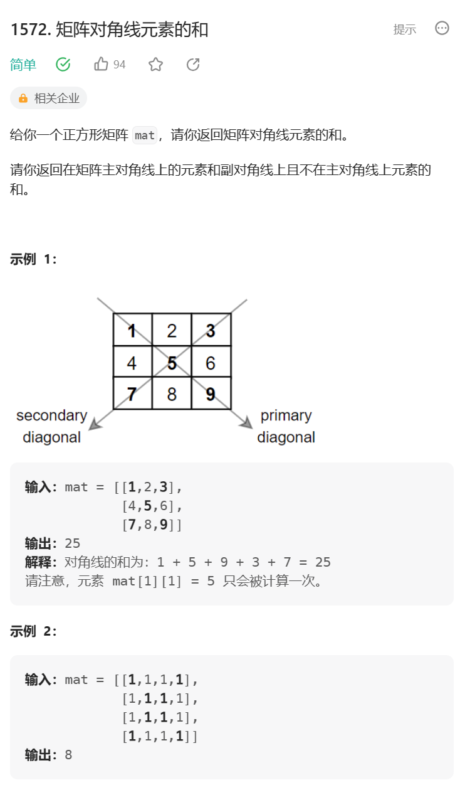
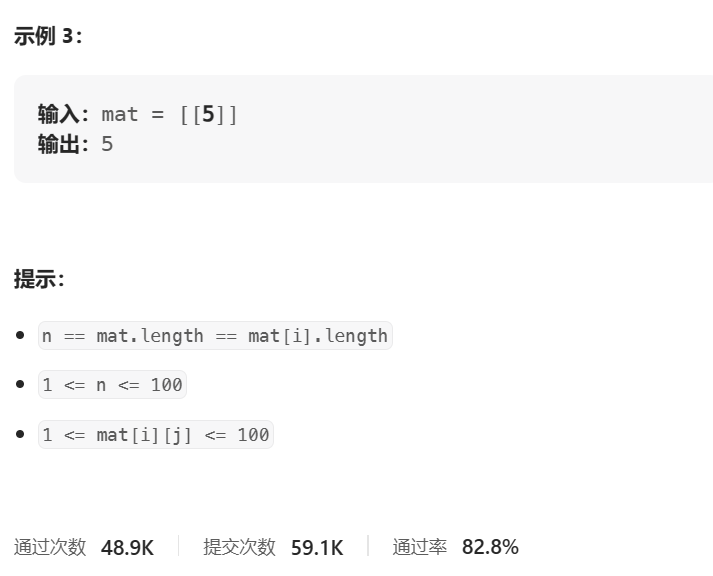

# 题目





# 我的题解

## 思路:暴力

遍历每一个数，判断是否在对角线上，不用判断重复

```C++
class Solution {
public:
    int diagonalSum(vector<vector<int>>& mat) {
        //正方形
        int n = mat.size();
        int res = 0;
        for (int i = 0; i < n; i++){
            for (int j = 0; j < n; j++){
                if (i == j || i == n - 1 -j){
                    res += mat[i][j];
                }
            }
        }
        return res;
    }
};
```


# 其他题解

## 其他1

```C++
class Solution {
public:
    int diagonalSum(vector<vector<int>>& mat) {
        int ans = 0;
        int n = mat.size();
        for (int i = 0; i < n; ++i) {
            int j = n - i - 1;
            //正对角线可以直接得出mat[i][i]  副对角线可以得出mat[i][n-1-j]  
            //还需要判断一下中心不能重复加
            ans += mat[i][i] + (i == j ? 0 : mat[i][j]);
        }
        return ans;
    }
};

```

