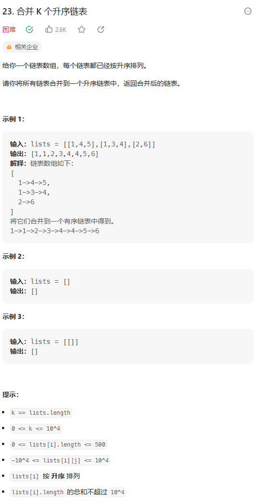
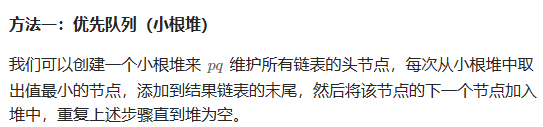

# 题目



# 我的题解

思路：用mutimap表存一下，有序 可重复，然后连接链表

```C++
/**
 * Definition for singly-linked list.
 * struct ListNode {
 *     int val;
 *     ListNode *next;
 *     ListNode() : val(0), next(nullptr) {}
 *     ListNode(int x) : val(x), next(nullptr) {}
 *     ListNode(int x, ListNode *next) : val(x), next(next) {}
 * };
 */
class Solution {
public:
    ListNode* mergeKLists(vector<ListNode*>& lists) {
        //有序，可重复
        multimap<int,ListNode*> hash;
        int n = lists.size();
        for (int i = 0; i < n; i++){
            ListNode* node = nullptr;
            node = lists[i];
            while(node){
                hash.insert({node->val,node});
                node = node->next;
            }
        }
        ListNode* dummy = new ListNode(-1);
        ListNode *cur = dummy;
        //连接链表
        for (auto it = hash.begin(); it != hash.end(); it++){
            cur->next = it->second;
            cur = cur->next;
            //cout<< it->first << endl;
        }
        return dummy->next;
    }
};
```

# 其他题解

## 其他1



```C++
/**
 * Definition for singly-linked list.
 * struct ListNode {
 *     int val;
 *     ListNode *next;
 *     ListNode() : val(0), next(nullptr) {}
 *     ListNode(int x) : val(x), next(nullptr) {}
 *     ListNode(int x, ListNode *next) : val(x), next(next) {}
 * };
 */
class Solution {
public:
    ListNode* mergeKLists(vector<ListNode*>& lists) {
        //lambda表达式，auto = function<bool(ListNode* a,ListNode* b)>
        auto cmp = [](ListNode* a, ListNode* b) { return a->val > b->val; };
        //小根堆，以第一个key，即头节点大小
        priority_queue<ListNode*, vector<ListNode*>, decltype(cmp)> pq;
        //存储头节点
        for (auto head : lists) {
            if (head) {
                pq.push(head);
            }
        }
        
        ListNode* dummy = new ListNode();
        ListNode* cur = dummy;
        while (!pq.empty()) {
            ListNode* node = pq.top();
            pq.pop();
            if (node->next) {
                pq.push(node->next);
            }
            cur->next = node;
            cur = cur->next;
        }
        return dummy->next;
    }
};
```

