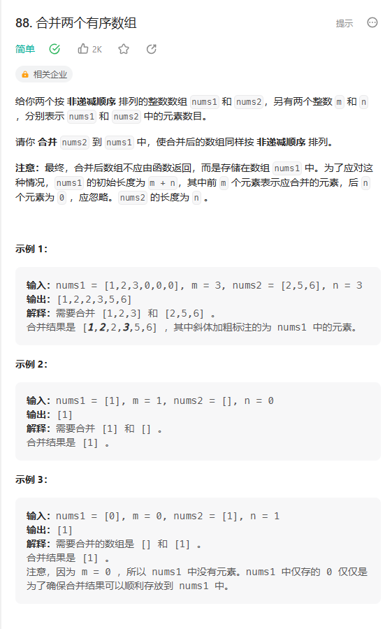

# 题目



# 我的题解

## 思路：

1.multimap表存，然后遍历  放入 vector 返回

--失败，因为可能会有小于0的数，我没法判断0的存在

```C++

```

2.使用两个指针来比较两个有序数组

--成功，从后往前遍历，可以实现在nums1的基础上来合并数组

```C++
class Solution {
public:
    void merge(vector<int>& nums1, int m, vector<int>& nums2, int n) {
	int i = m - 1, j = n - 1;
    int k = nums1.size() - 1;
	while (i >= 0 && j >= 0){
        if (nums1[i] >= nums2[j]){
            nums1[k--] = nums1[i--];
        }
        else{
            nums1[k--] = nums2[j--];
        }
    }
    while (j >= 0){
        nums1[k--] = nums2[j--];
    }
    while (i >= 0){
        nums1[k--] = nums1[i--];
    }
    }
};
```

