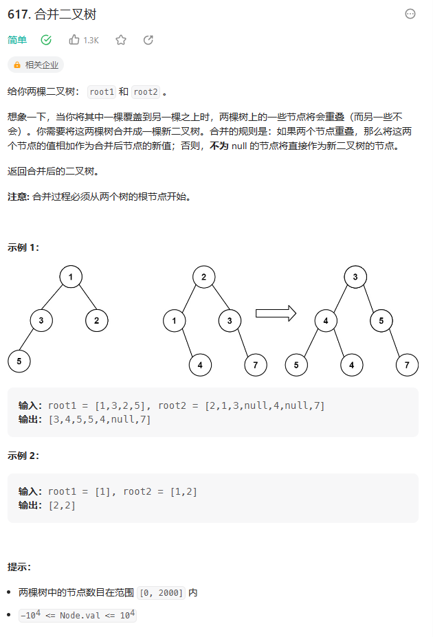
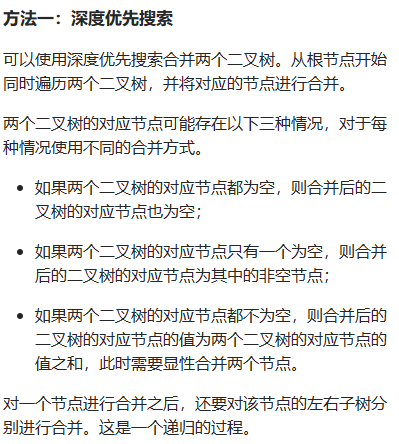

# 题目




# 我的题解

## 思路：递归 遍历

前序遍历，中序遍历，后序遍历都可以完成。


### 这是在t1的基础上做的修改

```C++
/**
 * Definition for a binary tree node.
 * struct TreeNode {
 *     int val;
 *     TreeNode *left;
 *     TreeNode *right;
 *     TreeNode() : val(0), left(nullptr), right(nullptr) {}
 *     TreeNode(int x) : val(x), left(nullptr), right(nullptr) {}
 *     TreeNode(int x, TreeNode *left, TreeNode *right) : val(x), left(left), right(right) {}
 * };
 */

//递归
 //后序遍历（前序遍历，中序遍历都可以），直接在原来的root1基础上修改，一方为空，就可以直接接上另一方的树（左子树或右子树）结构
class Solution {
public:
    TreeNode* mergeTrees(TreeNode* t1, TreeNode* t2) {
        if (t1 == NULL) return t2; // 如果t1为空，合并之后就应该是t2
        if (t2 == NULL) return t1; // 如果t2为空，合并之后就应该是t1
        // 修改了t1的数值和结构
        t1->left = mergeTrees(t1->left, t2->left);      // 左
        t1->right = mergeTrees(t1->right, t2->right);   // 右
        t1->val += t2->val;                             // 中
        return t1;
    }
};
```


# 其他题解

## 其他1

### 这是自己创建一个新树



```C++
class Solution {
public:
    TreeNode* mergeTrees(TreeNode* t1, TreeNode* t2) {
        if (t1 == nullptr) {
            return t2;
        }
        if (t2 == nullptr) {
            return t1;
        }
        auto merged = new TreeNode(t1->val + t2->val);
        merged->left = mergeTrees(t1->left, t2->left);
        merged->right = mergeTrees(t1->right, t2->right);
        return merged;
    }
};

作者：力扣官方题解
链接：https://leetcode.cn/problems/merge-two-binary-trees/solutions/424201/he-bing-er-cha-shu-by-leetcode-solution/
来源：力扣（LeetCode）
著作权归作者所有。商业转载请联系作者获得授权，非商业转载请注明出处。
```

