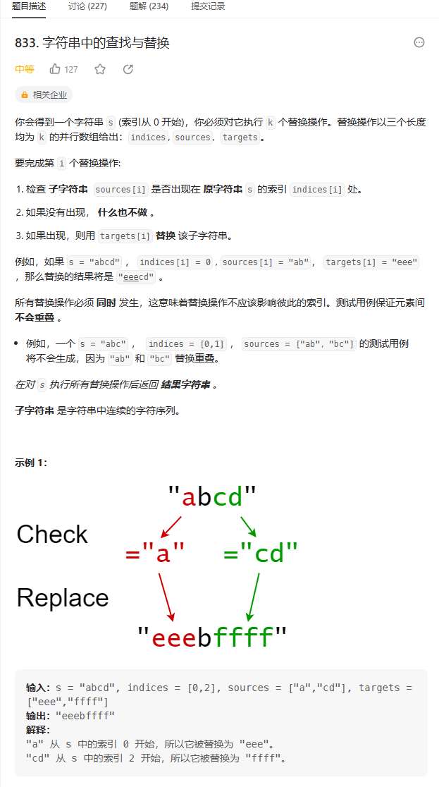
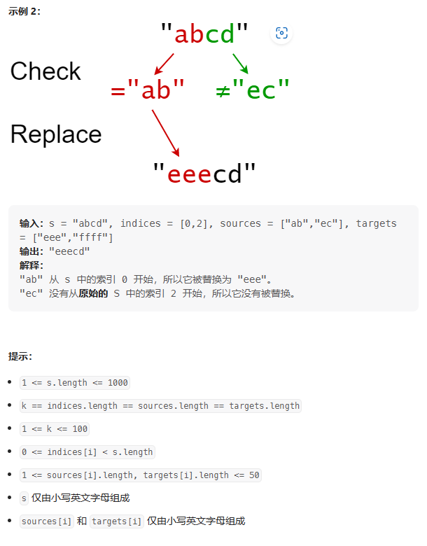
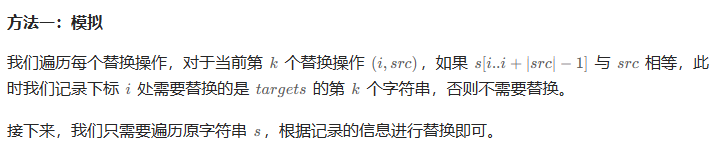

# 题目





# 我的题解

## 思路：模拟

### 错误的

```C++
class Solution {
public:
    //判断是否需要替换
    bool helper(const string& str, int index, const string& str2){
        int n = str2.size();
        return str.compare(index, n, str2, 0, n) == 0 ? true : false;
    }
    //执行替换
    string set(string str, int index, const string& str2){
        int n = str.size();
        int m = str2.size();
        string ret = "";
        if(n >= m){
            str.replace(index, m, str2);
            ret += str;    
        }
        else {
            //str.replace(index, m, str2.substr(0, m));
            //str += str2.substr(m, n - m); 
            ret += str2;
        }
        return ret;
    }
    string findReplaceString(string s, vector<int>& indices, vector<string>& sources, vector<string>& targets) {
        string res = "";
        //排序一下
        sort(indices.begin(), indices.end());
        if(indices[0] > 0){
            res += s.substr(0, indices[0]);
        }
        //cout<< res <<endl;
        for (int i = 0; i < indices.size(); i++){
            if (helper(s, indices[i], sources[i])){
                string temp1 = set(s.substr(indices[i], sources[i].size()), indices[i], targets[i]);
                res += temp1;
                cout << res <<endl;
                if(i + 1 < indices.size() && indices[i] + sources[i].size() < indices[i+1]){
                    string temp2 = s.substr(indices[i] + sources[i].size(), indices[i+1] - indices[i] - sources[i].size());
                    //cout << "temp2:"<< temp2 << endl;
                    res += temp2;
                    //cout << res << endl;
                }
            }
            //没有被替换
            else{
                if(i+1 < indices.size()) {
                    string temp3 = s.substr(indices[i], indices[i+1] - indices[i]);
                    res += temp3;
                }
                else{
                    string temp3 = s.substr(indices[i], s.size() - indices[i]);
                    res += temp3;
                }    
            }   
        }
        return res;
    }

};
```


# 其他题解

## 其他1



```C++
class Solution {
public:
    string findReplaceString(string s, vector<int>& indices, vector<string>& sources, vector<string>& targets) {
        int n = s.size();
        vector<int> d(n, -1);
        for (int k = 0; k < indices.size(); ++k) {
            int i = indices[k];
            if (s.compare(i, sources[k].size(), sources[k]) == 0) {
                d[i] = k;
            }
        }
        string ans;
        for (int i = 0; i < n;) {
            if (~d[i]) {
                ans += targets[d[i]];
                i += sources[d[i]].size();
            } else {
                ans += s[i++];
            }
        }
        return ans;
    }
};

```

