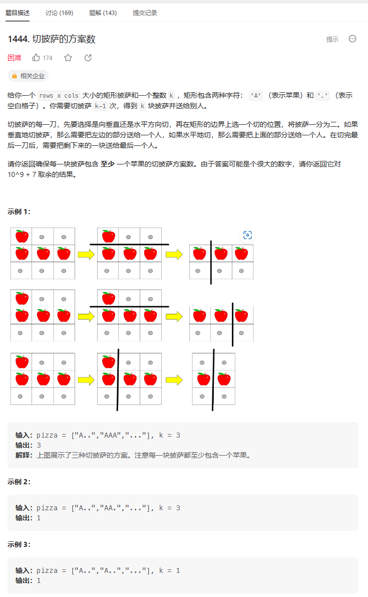
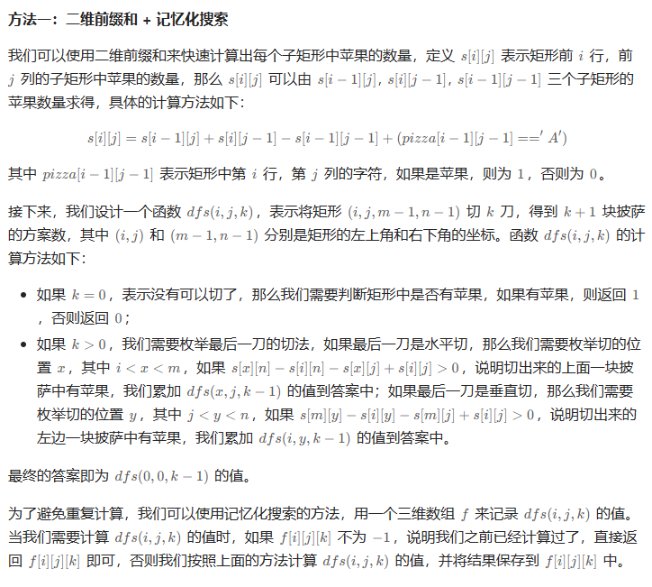
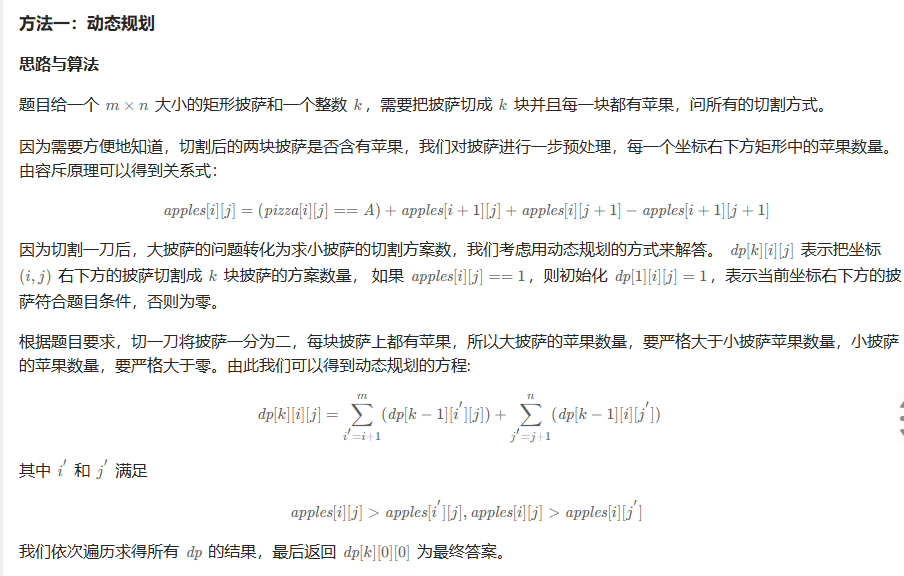

# 题目



# 我的题解

## 思路

每块披萨至少还有一个苹果


# 其他题解

## 其他1



```C++
class Solution {
public:
    int ways(vector<string>& pizza, int k) {
        const int mod = 1e9 + 7;
        int m = pizza.size(), n = pizza[0].size();
        vector<vector<vector<int>>> f(m, vector<vector<int>>(n, vector<int>(k, -1)));
        vector<vector<int>> s(m + 1, vector<int>(n + 1));
        for (int i = 1; i <= m; ++i) {
            for (int j = 1; j <= n; ++j) {
                int x = pizza[i - 1][j - 1] == 'A' ? 1 : 0;
                s[i][j] = s[i - 1][j] + s[i][j - 1] - s[i - 1][j - 1] + x;
            }
        }
        function<int(int, int, int)> dfs = [&](int i, int j, int k) -> int {
            if (k == 0) {
                return s[m][n] - s[i][n] - s[m][j] + s[i][j] > 0 ? 1 : 0;
            }
            if (f[i][j][k] != -1) {
                return f[i][j][k];
            }
            int ans = 0;
            for (int x = i + 1; x < m; ++x) {
                if (s[x][n] - s[i][n] - s[x][j] + s[i][j] > 0) {
                    ans = (ans + dfs(x, j, k - 1)) % mod;
                }
            }
            for (int y = j + 1; y < n; ++y) {
                if (s[m][y] - s[i][y] - s[m][j] + s[i][j] > 0) {
                    ans = (ans + dfs(i, y, k - 1)) % mod;
                }
            }
            return f[i][j][k] = ans;
        };
        return dfs(0, 0, k - 1);
    }
};

作者：ylb
链接：https://leetcode.cn/problems/number-of-ways-of-cutting-a-pizza/solutions/2392075/python3javacgotypescript-yi-ti-yi-jie-er-l3ec/
来源：力扣（LeetCode）
著作权归作者所有。商业转载请联系作者获得授权，非商业转载请注明出处。
```


## 其他2



```C++
class Solution {
public:
    int ways(vector<string>& pizza, int k) {
        int m = pizza.size(), n = pizza[0].size(), mod = 1e9 + 7;
        vector<vector<int>> apples(m + 1, vector<int>(n + 1));
        vector<vector<vector<int>>> dp(k + 1, vector<vector<int>>(m + 1, vector<int>(n + 1)));

        // 预处理
        for (int i = m - 1; i >= 0; i--) {
            for (int j = n - 1; j >= 0; j--) {
                apples[i][j] = apples[i][j + 1] + apples[i + 1][j] - apples[i + 1][j + 1] + (pizza[i][j] == 'A');
                dp[1][i][j] = apples[i][j] > 0;
            }
        }

        for (int ki = 2; ki <= k; ki++) {
            for (int i = 0; i < m; i++) {
                for (int j = 0; j < n; j++) {
                    // 水平方向切
                    for (int i2 = i + 1; i2 < m; i2++) {
                        if (apples[i][j] > apples[i2][j]) {
                            dp[ki][i][j] = (dp[ki][i][j] + dp[ki - 1][i2][j]) % mod;
                        }
                    }
                    // 垂直方向切
                    for (int j2 = j + 1; j2 < n; j2++) {
                        if (apples[i][j] > apples[i][j2]) {
                            dp[ki][i][j] = (dp[ki][i][j] + dp[ki - 1][i][j2]) % mod;
                        }
                    }
                }
            }
        }
        return dp[k][0][0];
    }
};

作者：力扣官方题解
链接：https://leetcode.cn/problems/number-of-ways-of-cutting-a-pizza/solutions/2387392/qie-pi-sa-de-fang-an-shu-by-leetcode-sol-7ik7/
来源：力扣（LeetCode）
著作权归作者所有。商业转载请联系作者获得授权，非商业转载请注明出处。
```

