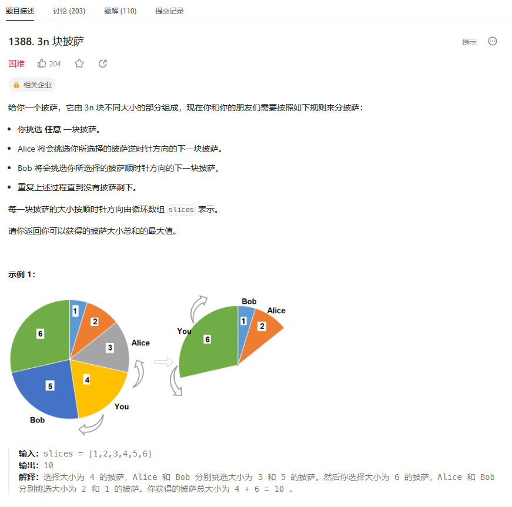
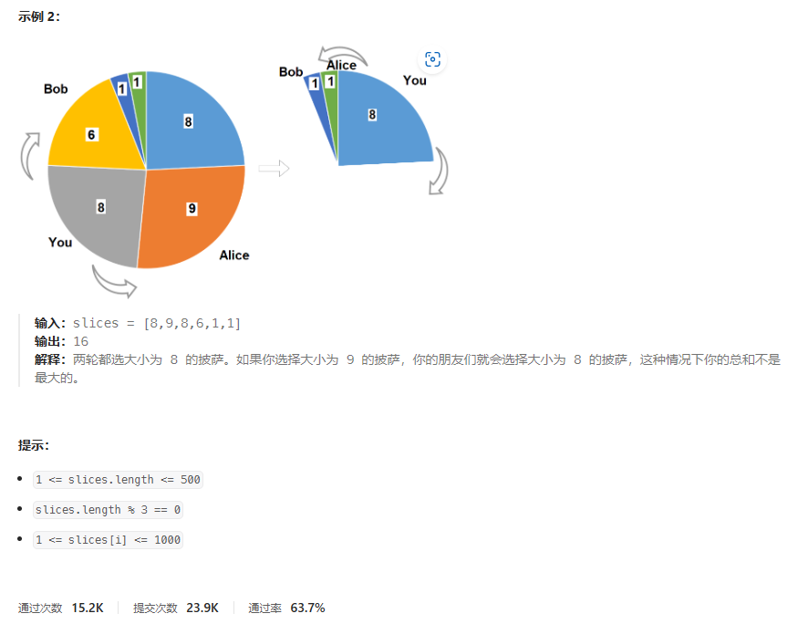
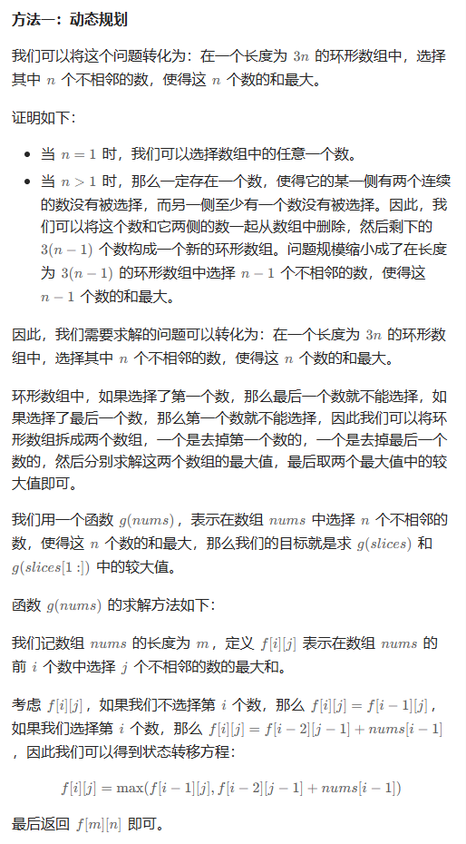
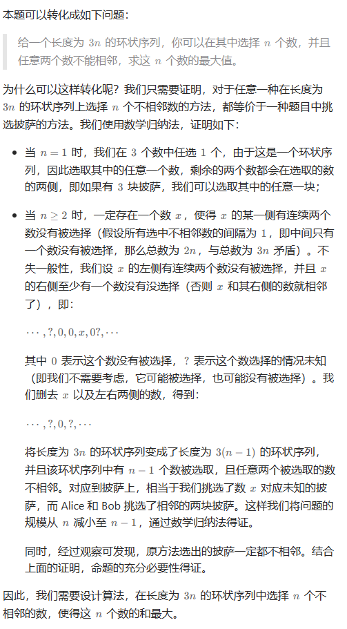
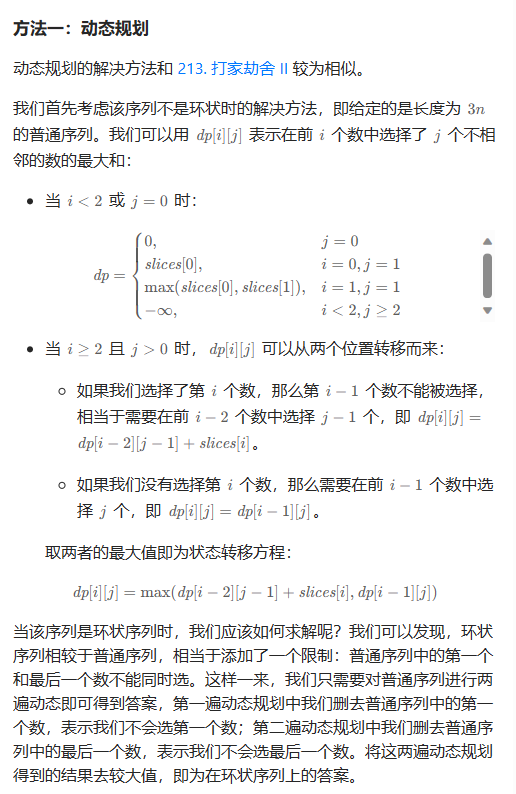

# 题目





# 我的题解

```

```


# 其他题解

## 其他1



```C++
class Solution {
public:
    int maxSizeSlices(vector<int>& slices) {
        int n = slices.size() / 3;
        auto g = [&](vector<int>& nums) -> int {
            int m = nums.size();
            int f[m + 1][n + 1];
            memset(f, 0, sizeof f);
            for (int i = 1; i <= m; ++i) {
                for (int j = 1; j <= n; ++j) {
                    f[i][j] = max(f[i - 1][j], (i >= 2 ? f[i - 2][j - 1] : 0) + nums[i - 1]);
                }
            }
            return f[m][n];
        };
        vector<int> nums(slices.begin(), slices.end() - 1);
        int a = g(nums);
        nums = vector<int>(slices.begin() + 1, slices.end());
        int b = g(nums);
        return max(a, b);
    }
};

作者：ylb
链接：https://leetcode.cn/problems/pizza-with-3n-slices/solutions/2393650/python3javacgotypescript-yi-ti-yi-jie-do-mhhj/
来源：力扣（LeetCode）
著作权归作者所有。商业转载请联系作者获得授权，非商业转载请注明出处。
```

## 其他2





```C++
class Solution {
public:
    int calculate(const vector<int>& slices) {
        int N = slices.size(), n = (N + 1) / 3;
        vector<vector<int>> dp(N, vector<int>(n + 1, INT_MIN));
        dp[0][0] = 0;
        dp[0][1] = slices[0];
        dp[1][0] = 0;
        dp[1][1] = max(slices[0], slices[1]);
        for (int i = 2; i < N; i++) {
            dp[i][0] = 0;
            for (int j = 1; j <= n; j++) {
                dp[i][j] = max(dp[i - 1][j], dp[i - 2][j - 1] + slices[i]);
            }
        }
        return dp[N - 1][n];
    }

    int maxSizeSlices(vector<int>& slices) {
        vector<int> v1(slices.begin() + 1, slices.end());
        vector<int> v2(slices.begin(), slices.end() - 1);
        int ans1 = calculate(v1);
        int ans2 = calculate(v2);
        return max(ans1, ans2);
    }
};

作者：力扣官方题解
链接：https://leetcode.cn/problems/pizza-with-3n-slices/solutions/177086/3n-kuai-pi-sa-by-leetcode-solution/
来源：力扣（LeetCode）
著作权归作者所有。商业转载请联系作者获得授权，非商业转载请注明出处。
```

