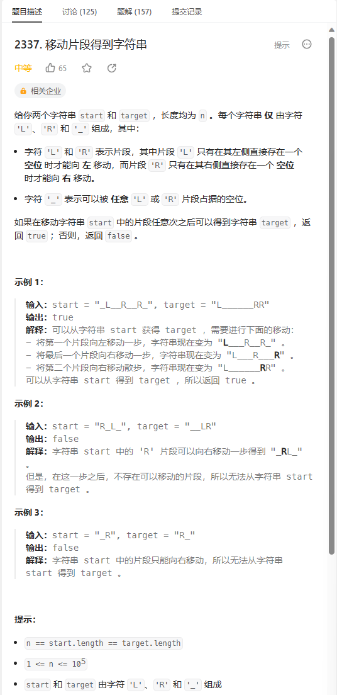
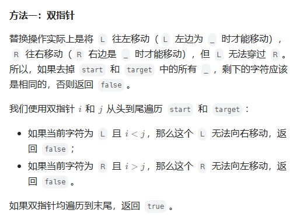
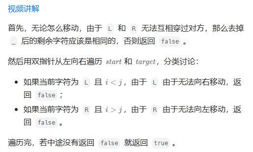

# 题目



# 我的题解

## 思路：


# 其他题解

## 其他1



```C++
class Solution {
public:
    bool canChange(string start, string target) {
        int n = start.size();
        int i = 0, j = 0;
        while (true) {
            while (i < n && start[i] == '_') ++i;
            while (j < n && target[j] == '_') ++j;
            //如果start和target同时遍历结束，说明L和R字符相等
            if (i == n && j == n) return true;
            //如果仅有其中一个遍历结束说明字符个数不同
            if (i == n || j == n || start[i] != target[j]) return false;
            //先判断字符是否相同
            if (start[i] == 'L' && i < j) return false;
            if (start[i] == 'R' && i > j) return false;
            ++i;
            ++j;
        }
    }
};

作者：ylb
链接：https://leetcode.cn/problems/move-pieces-to-obtain-a-string/solutions/2397699/python3javacgotypescript-yi-ti-yi-jie-sh-xlzu/
来源：力扣（LeetCode）
著作权归作者所有。商业转载请联系作者获得授权，非商业转载请注明出处。
```

## 其它2



```C++
class Solution {
public:
    bool canChange(string start, string target) {
        auto s = start, t = target;
        s.erase(remove(s.begin(), s.end(), '_'), s.end());
        t.erase(remove(t.begin(), t.end(), '_'), t.end());
        if (s != t) return false;
        for (int i = 0, j = 0; i < start.length(); i++) {
            if (start[i] == '_') continue;
            while (target[j] == '_')
                j++;
            if (i != j && (start[i] == 'L') == (i < j))
                return false;
            ++j;
        }
        return true;
    }
};

作者：灵茶山艾府
链接：https://leetcode.cn/problems/move-pieces-to-obtain-a-string/solutions/1658923/nao-jin-ji-zhuan-wan-pythonjavacgo-by-en-9sqt/
来源：力扣（LeetCode）
著作权归作者所有。商业转载请联系作者获得授权，非商业转载请注明出处。
```

