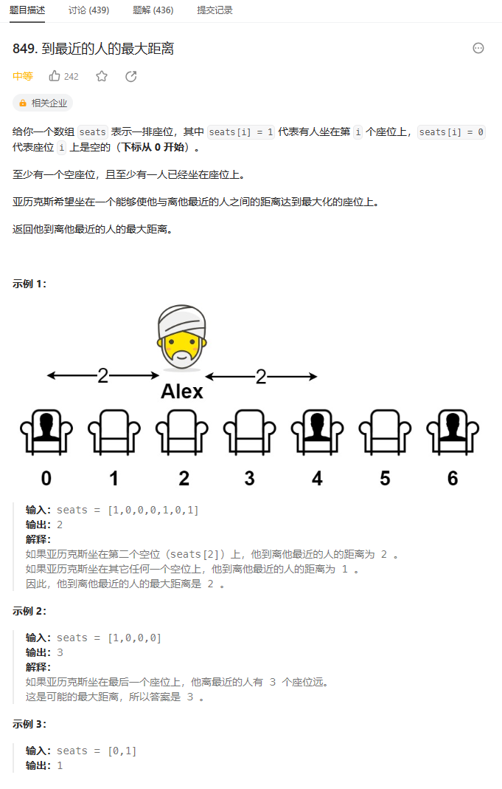
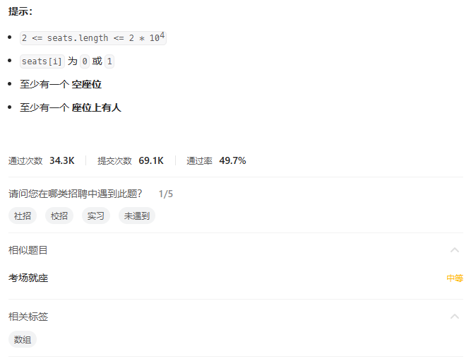
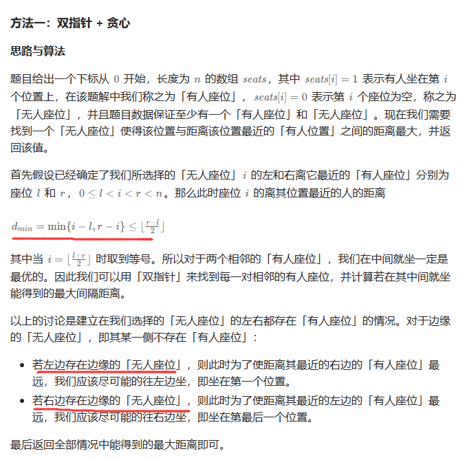

# 题目





# 我的题解

### 思路

最大最小，一开始想到是二分法，但是不会写

然后转化为找距离最大的2人，计算中间，然后发现可能会有旁边都是空位的，不太会写

所以关键是会写找到左边和右边都是无人座位的代码


看了一个标准题解的思路没想到就写出来了，没看代码，就是改了下计算和判断中间距离的方法

加了最左边和最右边距离比较

```C++
class Solution {
public:
    int maxDistToClosest(vector<int>& seats) {
        //最大最小，感觉需要使用到二分法
        //感觉是找到2个人之间的最大距离，然后这个距离是包含到人的 ，需要+1
        //一次遍历
        int res = INT_MIN;
        int res1 = 0, res2 = 0;
        for (int i = 0; i < seats.size(); i++){
            if (seats[i] == 1){
                int j = i + 1;
                while(j < seats.size() && seats[j] == 0){
                    j++;
                }
                //代表是中间距离的计算
                if (j < seats.size() && seats[j] == 1){
                    int temp = (j - i) / 2;
                    res = max(res, temp);
                }
            }
        }
        //考虑左边和右边都有空座位的情况，那么就选择坐在坐左边和最右边，左后选择三种情况的最小值
        int i = 0;
        while(i < seats.size() && seats[i] == 0){
            i++;
        }
        res1 = i;
        i = seats.size() - 1;
        int j = 0;
        while(i >= 0 && seats[i--] == 0){
            j++;
        }
        res2 = j;
        return max({res, res1, res2});
    }
};
```


# 其他题解

## 其他1



```C++
class Solution {
public:
    int maxDistToClosest(vector<int>& seats) {
        int res = 0;
        int l = 0;
        //计算最左边距离
        while (l < seats.size() && seats[l] == 0) {
            ++l;
        }
        res = max(res, l);
        
        while (l < seats.size()) {
            //从第一个1的下一位开始，这里多加了一个1，所以后面在减一
            int r = l + 1;
            while (r < seats.size() && seats[r] == 0) {
                ++r;
            }
            //判断为最右边距离计算，说明没碰第二个到1
            if (r == seats.size()) {
                res = max(res, r - l - 1);//r-（l+1)
            } else {
                //碰到了第二个1，计算为中间节点
                res = max(res, (r - l) / 2);
            }
            l = r;
        }
        return res;//从第2个1的下一个开始
    }
};

作者：力扣官方题解
链接：https://leetcode.cn/problems/maximize-distance-to-closest-person/solutions/2393766/dao-zui-jin-de-ren-de-zui-da-ju-chi-by-l-zboe/
来源：力扣（LeetCode）
著作权归作者所有。商业转载请联系作者获得授权，非商业转载请注明出处。
```

我重写了位置后

```C++
class Solution {
public:
    int maxDistToClosest(vector<int>& seats) {
        int res = 0;
        int l = 0;
        //计算最左边距离
        while (l < seats.size() && seats[l] == 0) {
            ++l;
        }
        res = max(res, l);
        
        while (l < seats.size()) {
            //从第一个1的开始
            int r = l;
            while (r < seats.size() && seats[r] == 0) {
                ++r;
            }
            //判断为最右边距离计算，说明没碰第二个到1
            if (r == seats.size()) {
                res = max(res, r - l);
            } else {
                //碰到了第二个1，计算为中间节点
                res = max(res, (r - l + 1) / 2);
            }
            l = r + 1;
        }
        return res;//从第2个1的开始
    }
};
```

