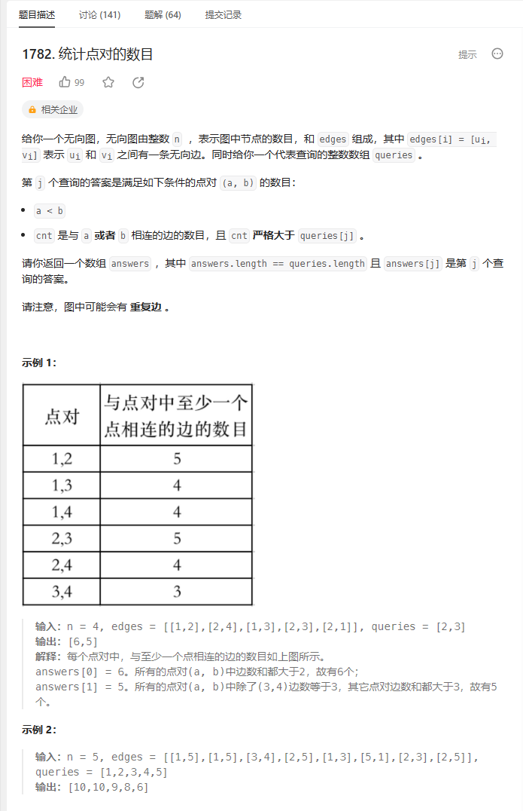
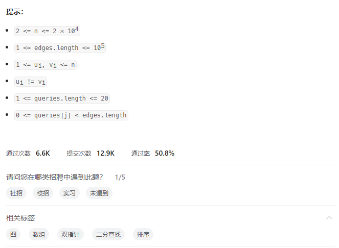
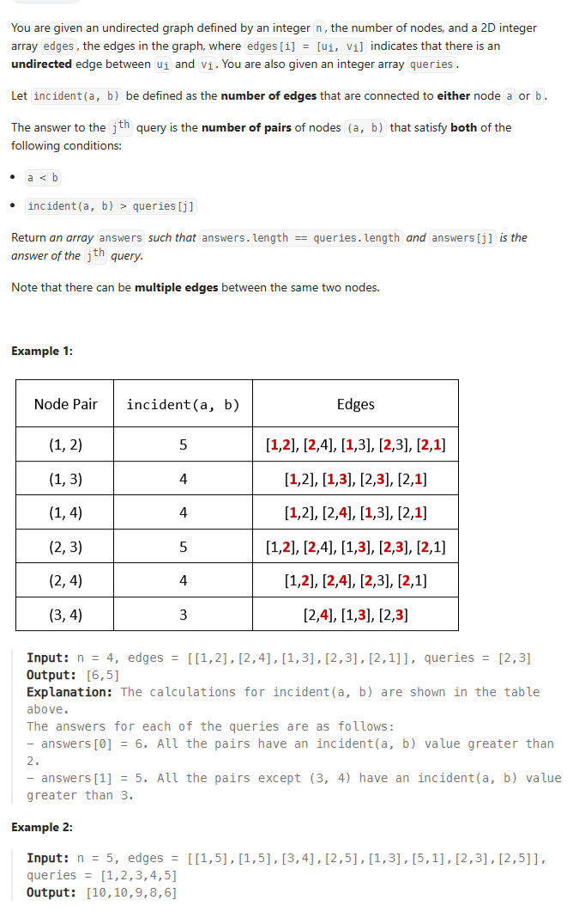
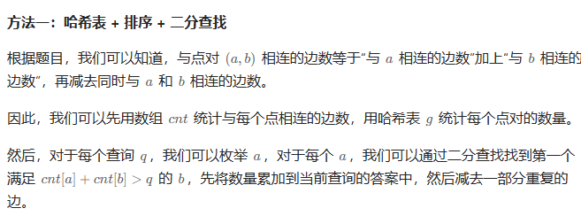

# 题目







# 我的题解

## 思路：

图论题目都没看懂


后来看了英文题目有点懂了

就是计算大于queries[i]的边的数量

incident(a,b)为连接节点a或节点b的边数量

# 其他题解

## 其他1



```C++
class Solution {
public:
    vector<int> countPairs(int n, vector<vector<int>>& edges, vector<int>& queries) {
        vector<int> cnt(n);
        unordered_map<int, int> g;
        for (auto& e : edges) {
            int a = e[0] - 1, b = e[1] - 1;
            ++cnt[a];
            ++cnt[b];
            int k = min(a, b) * n + max(a, b);
            ++g[k];
        }
        vector<int> s = cnt;
        sort(s.begin(), s.end());
        vector<int> ans(queries.size());
        for (int i = 0; i < queries.size(); ++i) {
            int t = queries[i];
            for (int j = 0; j < n; ++j) {
                int x = s[j];
                int k = upper_bound(s.begin() + j + 1, s.end(), t - x) - s.begin();
                ans[i] += n - k;
            }
            for (auto& [k, v] : g) {
                int a = k / n, b = k % n;
                if (cnt[a] + cnt[b] > t && cnt[a] + cnt[b] - v <= t) {
                    --ans[i];
                }
            }
        }
        return ans;
    }
};

作者：ylb
链接：https://leetcode.cn/problems/count-pairs-of-nodes/solutions/2400706/python3javacgotypescript-yi-ti-yi-jie-ha-gjfh/
来源：力扣（LeetCode）
著作权归作者所有。商业转载请联系作者获得授权，非商业转载请注明出处。
```

