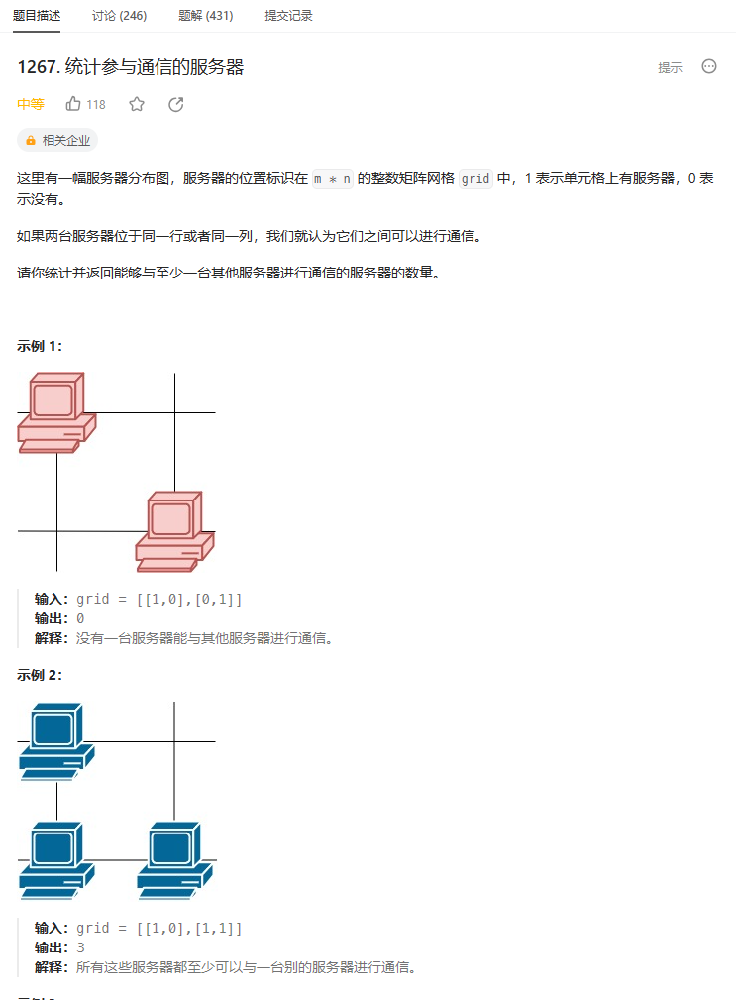
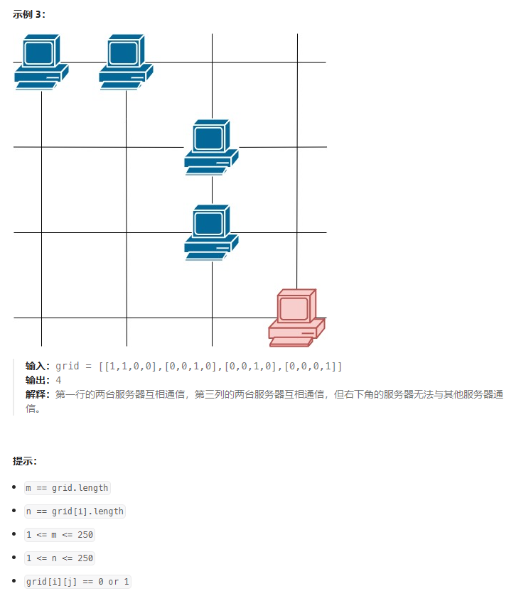
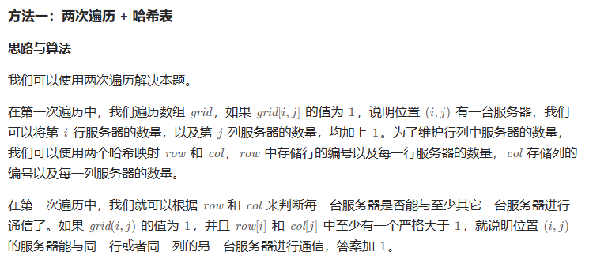
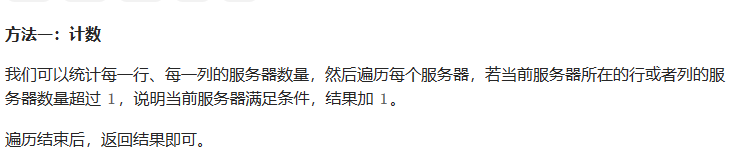

# 题目





# 我的题解

## 思路：

这里我是想统计行的，再统计列的，然后把重复的去掉，但是我发现这个重复的也不是很好判断

好在最后用自己的方式实现了统计

```C++
class Solution {
public:
    int countServers(vector<vector<int>>& grid) {
        //在同一列或者是同一行就可以通信，那么如果我们分别统计行和列的话，势必就会造成重复，所以我们可以使用visit表来记录是否已经计算过了，如果计算过了，那么就不会再统计一次
        int m = grid.size();
        int n = grid[0].size();
        int res = 0;
        
        vector<vector<int>> visit(m,vector<int>(n,0));
        //遍历每一行
        for (int i = 0; i < m; i++){
            int temp = 0;
            for (int j = 0; j < n; j++){
                //只有有设备时，才会有访问
                if(grid[i][j] == 1)visit[i][j] = 1;
                temp += grid[i][j];
            }
            //如果有1台以上
            if(temp > 1) {
                res += temp;    
            }
            else {
            //如果都没到2台，那就当没访问过这一行
                for (int j = 0; j < n; j++){
                    visit[i][j] = 0;  
            }
            }
        }
        //cout << res << endl;
        //遍历每一列
        //遍历列的话，元素还是[i][j]不是[j][i]
        for (int j = 0; j < n; j++){
            int temp = 0;
            int jian = 0;
            for (int i = 0; i < m; i++){
                //这个是统计重复的
                if (visit[i][j] == 1){
                    jian++;
                    //cout << i << " " << j <<endl;
                }
                temp += grid[i][j];
                //cout << grid[j][i] << " " << temp; 
                //cout<< j << " " << i << " " << grid[j][i] << endl;
            }
           //cout << temp << " " << jian << endl;
            //最终加上每一列结果
            if(temp > 1) res += temp - jian;
          
        }
        return res;
    }
};
```


# 其他题解

## 其他1



```C++
class Solution {
public:
    int countServers(vector<vector<int>>& grid) {
        int m = grid.size(), n = grid[0].size();
        unordered_map<int, int> rows, cols;
        for (int i = 0; i < m; ++i) {
            for (int j = 0; j < n; ++j) {
                if (grid[i][j] == 1) {
                    ++rows[i];
                    ++cols[j];
                }
            }
        }
        int ans = 0;
        for (int i = 0; i < m; ++i) {
            for (int j = 0; j < n; ++j) {
                if (grid[i][j] == 1 && (rows[i] > 1 || cols[j] > 1)) {
                    ++ans;
                }
            }
        }
        return ans;
    }
};

作者：力扣官方题解
链接：https://leetcode.cn/problems/count-servers-that-communicate/solutions/101819/tong-ji-can-yu-tong-xin-de-fu-wu-qi-by-leetcode-so/
来源：力扣（LeetCode）
著作权归作者所有。商业转载请联系作者获得授权，非商业转载请注明出处。
```


## 其他2



```C++
class Solution {
public:
    int countServers(vector<vector<int>>& grid) {
        int m = grid.size(), n = grid[0].size();
        vector<int> row(m), col(n);
        for (int i = 0; i < m; ++i) {
            for (int j = 0; j < n; ++j) {
                if (grid[i][j]) {
                    ++row[i];
                    ++col[j];
                }
            }
        }
        int ans = 0;
        for (int i = 0; i < m; ++i) {
            for (int j = 0; j < n; ++j) {
                ans += grid[i][j] && (row[i] > 1 || col[j] > 1);
            }
        }
        return ans;
    }
};

作者：ylb
链接：https://leetcode.cn/problems/count-servers-that-communicate/solutions/2402089/python3javacgotypescript-yi-ti-yi-jie-ji-arec/
来源：力扣（LeetCode）
著作权归作者所有。商业转载请联系作者获得授权，非商业转载请注明出处。
```

