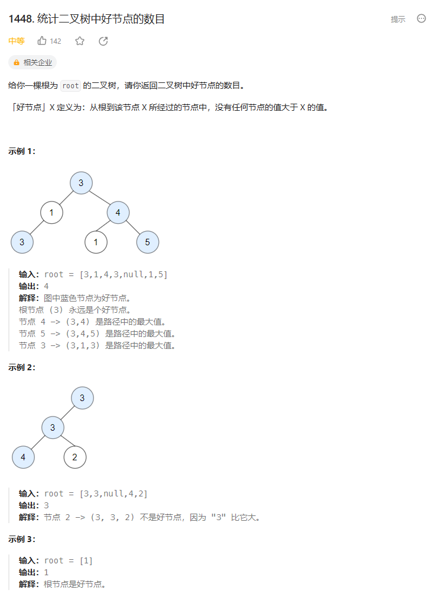
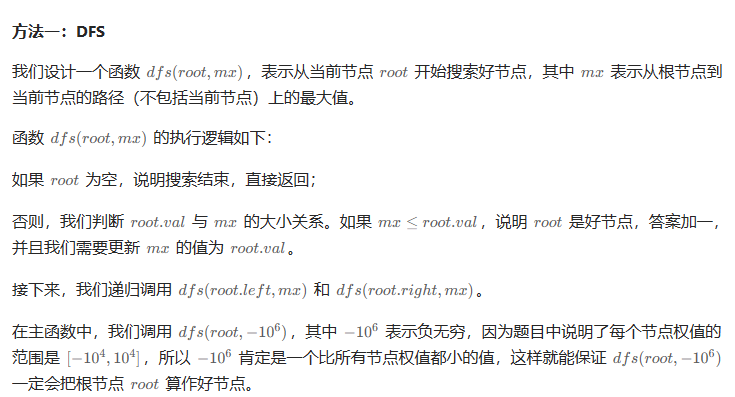

# 题目



# 我的题解

## 思路：前序遍历比较

独立完成，前序遍历，然后比较，不需要回溯，因为我们就是前序遍历然后比较，最大值也是单条路径上的。

```C++
/**
 * Definition for a binary tree node.
 * struct TreeNode {
 *     int val;
 *     TreeNode *left;
 *     TreeNode *right;
 *     TreeNode() : val(0), left(nullptr), right(nullptr) {}
 *     TreeNode(int x) : val(x), left(nullptr), right(nullptr) {}
 *     TreeNode(int x, TreeNode *left, TreeNode *right) : val(x), left(left), right(right) {}
 * };
 */
class Solution {
public:
int res = 0;
    //最大值是随着路径变化的
    void helper(TreeNode* node, int maxnum){
        if (!node) return;
        //没有节点大于，那就是大于等于可以
        if (node->val >= maxnum) {
            res++;
            maxnum = node->val;
        }
        helper(node->left, maxnum);
        helper(node->right, maxnum);
    }
    int goodNodes(TreeNode* root) {
        //题目说从根节点到X节点，说明是前序遍历
        //那我们用前序遍历来遍历树，然后记录路径上的最大值，如果最大值没有大于当前节点，那就说明这个节点是好节点，同时更新其为最大值
        //前序遍历（递归写法）
        helper(root, INT_MIN);
        return res;
    }
};
```


# 其他题解

## 其他1

深度优先搜索


```C++
class Solution {
public:
    //可以直接写返回值的dfs，而不像我的那样，定义全局变量
    int dfs(TreeNode* root, int path_max) {
        if (root == nullptr) {
            return 0;
        }
        int res = 0;
        if (root->val >= path_max) {
            res++;
            path_max = root->val;
        }
        //那就需要使用到相加
        res += dfs(root->left, path_max) + dfs(root->right, path_max);
        return res;
    }

    int goodNodes(TreeNode* root) {
        return dfs(root, INT_MIN);
    }
};

作者：力扣官方题解
链接：https://leetcode.cn/problems/count-good-nodes-in-binary-tree/solutions/2399336/tong-ji-er-cha-shu-zhong-hao-jie-dian-de-dqtl/
来源：力扣（LeetCode）
著作权归作者所有。商业转载请联系作者获得授权，非商业转载请注明出处。
```


## 其他2

==仅是写法上的不同，喜欢使用lambda表达式==

==可以不用定义全局变量，而使用引用捕捉的方式==



```C++
/**
 * Definition for a binary tree node.
 * struct TreeNode {
 *     int val;
 *     TreeNode *left;
 *     TreeNode *right;
 *     TreeNode() : val(0), left(nullptr), right(nullptr) {}
 *     TreeNode(int x) : val(x), left(nullptr), right(nullptr) {}
 *     TreeNode(int x, TreeNode *left, TreeNode *right) : val(x), left(left), right(right) {}
 * };
 */
class Solution {
public:
    int goodNodes(TreeNode* root) {
        int ans = 0;
        function<void(TreeNode*, int)> dfs = [&](TreeNode* root, int mx) {
            if (!root) {
                return;
            }
            if (mx <= root->val) {
                ++ans;
                mx = root->val;
            }
            dfs(root->left, mx);
            dfs(root->right, mx);
        };
        dfs(root, -1e6);
        return ans;
    }
};

作者：ylb
链接：https://leetcode.cn/problems/count-good-nodes-in-binary-tree/solutions/2403705/python3javacgotypescript-yi-ti-yi-jie-df-p1mz/
来源：力扣（LeetCode）
著作权归作者所有。商业转载请联系作者获得授权，非商业转载请注明出处。
```

## 其他3

使用DFS 递归的时候，直接判断子树的节点和父节点的大小，如果子节点大，则更新rootVal，这样比较的始终是最大值，就不用额外存储最大值了

```C++
        public int goodNodes(TreeNode root) {
            int rootVal = root.val;
            return 1 + dfs(root.left, rootVal) + dfs(root.right, rootVal);
        }

        public int dfs(TreeNode root, int rootVal) {
            if (root == null) {
                return 0;
            }
            if (root.val >= rootVal) {
                return 1 + dfs(root.left, root.val) + dfs(root.right, root.val);
            } else {
                return dfs(root.left, rootVal) + dfs(root.right, rootVal);
            }
        }
```

