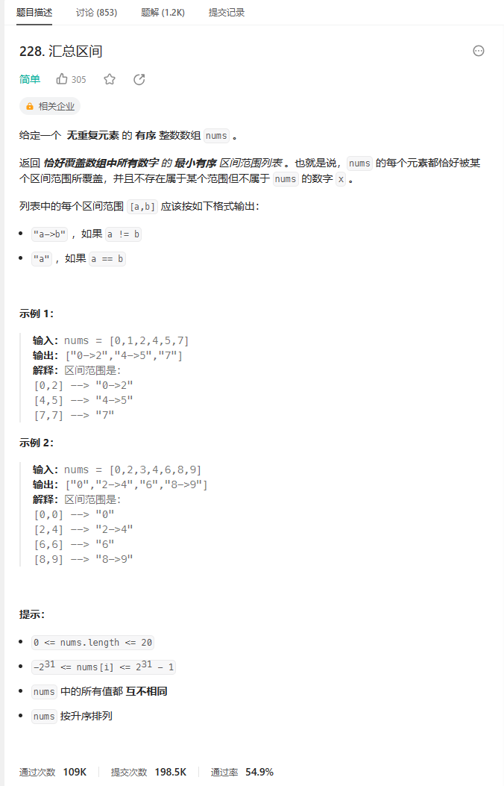
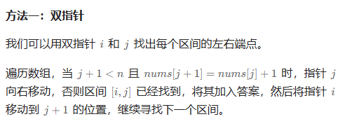
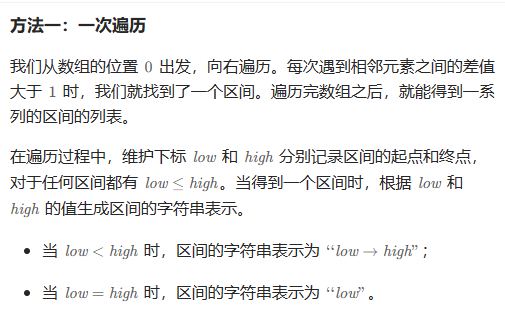

# 题目



# 我的题解

## 思路：模拟，使用了双指针

```C++
class Solution {
public:
    vector<string> summaryRanges(vector<int>& nums) {
        //题目意思是写出区间包含nums中所有数字，并且不允许出现在范围内
        //的数字不在nums中
        //可以直接遍历来找，如果发现下一个数字大小与前面连接不上，就先写出一个范围
        vector<string> res;
        for (int i = 0; i < nums.size(); i++){
            int j = i + 1;
            string temp = "";
            while (j < nums.size() && nums[j] == nums[j-1] + 1){
                j++;              
            }
            j--;
            if (nums[i] != nums[j])temp += to_string(nums[i]) + "->" + to_string(nums[j]);  
            else temp += to_string(nums[i]);
            res.push_back(temp);
            i = j;
        }
        return res;
    }
};
```


# 其他题解

## 其他1

和我自己写的思路一样，都是找到区间的端点。



```C++
class Solution {
public:
    vector<string> summaryRanges(vector<int>& nums) {
        vector<string> ans;
        auto f = [&](int i, int j) {
            return i == j ? to_string(nums[i]) : to_string(nums[i]) + "->" + to_string(nums[j]);
        };
        for (int i = 0, j, n = nums.size(); i < n; i = j + 1) {
            j = i;
            while (j + 1 < n && nums[j + 1] == nums[j] + 1) {
                ++j;
            }
            ans.emplace_back(f(i, j));
        }
        return ans;
    }
};

作者：ylb
链接：https://leetcode.cn/problems/summary-ranges/solutions/2411792/python3javacgotypescript-yi-ti-yi-jie-sh-gpep/
来源：力扣（LeetCode）
著作权归作者所有。商业转载请联系作者获得授权，非商业转载请注明出处。
```

## 其他2



```C++
class Solution {
public:
    vector<string> summaryRanges(vector<int>& nums) {
        vector<string> ret;
        int i = 0;
        int n = nums.size();
        //一次遍历
        while (i < n) {
            int low = i;
            i++;
            //开始内部找端点
            while (i < n && nums[i] == nums[i - 1] + 1) {
                i++;
            }
            //i找到的是第一个不符的，所以需要减一
            int high = i - 1;
            string temp = to_string(nums[low]);
            if (low < high) {
                //使用了string append 追加方法
                temp.append("->");
                temp.append(to_string(nums[high]));
            }
            ret.push_back(move(temp));
        }
        return ret;
    }
};

作者：力扣官方题解
链接：https://leetcode.cn/problems/summary-ranges/solutions/553645/hui-zong-qu-jian-by-leetcode-solution-6zrs/
来源：力扣（LeetCode）
著作权归作者所有。商业转载请联系作者获得授权，非商业转载请注明出处。
```

